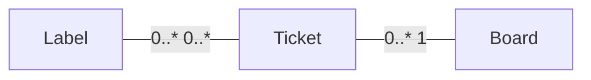
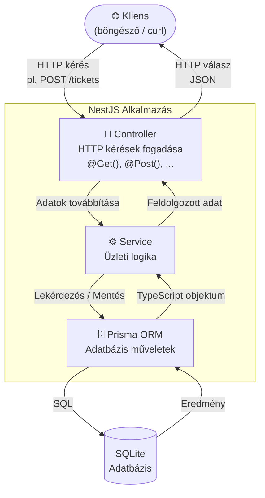

# Backend Fejlesztés NestJS-sel

Üdvözlünk a backend fejlesztő tanfolyamon! Ezen az órán egy modern, skálázható és robusztus backend alkalmazást fogunk felépíteni **Node.js** alapokon, a **NestJS** keretrendszer segítségével.

A projektünk egy **Hibajegy-kezelő (Ticketing) Rendszer** lesz. Adatbázisként **SQLite**-ot használunk, az adatbázis-műveleteket pedig a **Prisma ORM** segítségével fogjuk elvégezni.

:::info A végső célunk
Egy olyan REST API létrehozása, amely képes kezelni a hibajegyek létrehozását, lekérdezését, frissítését és törlését (CRUD műveletek). Ez az API később könnyen bővíthető lesz további funkciókkal, például felhasználókezeléssel, jogosultságokkal, stb. (habár erre a tanfolyamon nem fogunk kitérni).
:::

:::tip Mintaprojekt
A tanfolyam során készülő projekt forráskódja elérhető a GitHub-on: [ticketing-api-2026](https://github.com/kir-dev/ticketing-api-2026)

Minden fejezet végén egy-egy branch-en megtalálod az aktuális állapotot (`chapter-1`, `chapter-2`, stb.).
:::

Vágjunk is bele!

---

## Chapter 1: Projekt inicializálás és a NestJS alapjai

Ebben a részben generálunk egy új NestJS projektet TypeScript támogatással, és megismerkedünk a keretrendszer alapvető építőköveivel.

### Az adatmodell áttekintése

Mielőtt belevágnánk a kódolásba, nézzük meg, mit fogunk felépíteni! Az alábbi diagram az alkalmazásunk teljes adatmodelljét mutatja be:



- **BOARDS → TICKET**: Egy-a-többhöz kapcsolat — egy táblához több hibajegy tartozhat, de minden hibajegy pontosan egy táblához tartozik (`boardsId` FK).
- **TICKET ↔ LABEL**: Több-a-többhöz kapcsolat — egy hibajegynek több címkéje is lehet, és egy címke több hibajegyen is szerepelhet (a Prisma automatikusan kezeli a kapcsolótáblát).

### A NestJS CLI telepítése

A fejlesztés megkezdése előtt szükségünk van a NestJS parancssori eszközére (CLI). Csomagkezelőnek az `npm`-et (Node Package Manager) fogjuk használni.

Nyiss egy terminált, és futtasd a következő parancsot:

```bash
npm install -g @nestjs/cli
```

**Parancs magyarázata:**

- `npm install`: Csomag telepítését kéri a Node.js csomagkezelőjétől.
- `-g` (global): Globálisan telepíti a gépedre a csomagot, így bárhonnan elérheted a `nest` parancsot a terminálból.
- `@nestjs/cli`: A hivatalos NestJS parancssori eszköz neve.

### A projekt létrehozása

Most létrehozunk egy új alkalmazást `ticketing-app` néven:

```bash
nest new ticketing-app
```

**Parancs magyarázata:**

- `nest new`: A CLI-t utasítja egy új projekt generálására az alapértelmezett fájlokkal, mappaszerkezettel és TypeScript támogatással.
- `ticketing-app`: A projektünk mappájának és egyben az alkalmazásnak a neve. _(A parancs futtatása közben a CLI megkérdezi, melyik csomagkezelőt szeretnéd használni. Válaszd az `npm`-et!)_

Lépjünk be a létrehozott mappába:

```bash
cd ticketing-app
```

### Környezeti változók (.env) beállítása

A backend alkalmazásoknál bevett szokás, hogy a konfigurációs beállításokat környezeti változókban (Environment Variables) tároljuk.

#### Mi az a `.env` fájl?

A `.env` (environment, azaz "környezet") fájl egy egyszerű szöveges fájl, amelyben **kulcs=érték** párok formájában tárolunk konfigurációs beállításokat:

```
PORT=3000
DATABASE_URL=file:./dev.db
```

**Miért használjuk?**
Képzeld el, hogy az alkalmazásod egyszer a saját gépeden fut fejlesztés közben, egyszer egy teszt szerveren, egyszer pedig éles környezetben. Mindhárom helyen más portot, más adatbázist, más jelszavakat kell használni. Ha ezeket az értékeket közvetlenül a kódba írnád ("hardcode"), minden környezetváltáskor módosítani kellene a forráskódot. A `.env` fájllal ezt elkerülöd: **a kód ugyanaz marad**, csak a `.env` fájl tartalma változik környezetenként.

:::warning Biztonsági figyelmeztetés
A `.env` fájl gyakran tartalmaz érzékeny adatokat (jelszavakat, API kulcsokat). Ezért **soha ne töltsd fel a GitHubra!** Ellenőrizd, hogy a `.gitignore` fájlodban szerepel-e a `.env` sor — a NestJS projekt generálásakor ez automatikusan megtörténik.
:::

:::tip
Szokás szerint a projektben találsz egy `.env.example` fájlt, amely tartalmazza az összes szükséges kulcsot, de éles értékek nélkül. Ez biztonságosan feltölthető GitHubra, és megmutatja az új fejlesztőknek, hogy milyen változókat kell beállítaniuk.
:::

Hozd létre a projekt gyökerében (a `package.json` fájllal egy szinten) egy új fájlt `.env` néven, és add hozzá a következő tartalmat:

```env title=".env"
PORT=3000
DATABASE_URL=file:./dev.db
```

_A `PORT` a szerver portja. A `DATABASE_URL` az SQLite adatbázis fájl elérési útja — ezt a Prisma fogja használni a 3. fejezetben._

:::tip
Ha a projektben van `.env.example` fájl, elegendő annak tartalmát átmásolni a `.env` fájlba — az összes szükséges kulcs már ott van.
:::

### Dekorátorok (Decorators)

A NestJS-ben gyakran fogsz látni `@` jellel kezdődő kifejezéseket a függvények és osztályok felett, ilyeneket mint `@Controller()`, `@Get()`, `@Injectable()` vagy `@Module()`. Ezek a **dekorátorok** (decorators) — speciális TypeScript funkciók, amelyek extra viselkedést vagy metaadatot adnak az alattuk lévő elemhez. Például a `@Get()` megmondja a NestJS-nek, hogy ez a metódus egy GET kérésre fog válaszolni, a `@Controller('boards')` pedig az útvonalat definiálja. A dekorátorok nem változtatják meg magát a kódot, csak "felcímkézik", hogy a keretrendszer tudja, hogyan kezelje.

### Az alkalmazás architektúrája

A NestJS egy erősen strukturált keretrendszer. Három fő építőköve van:

1. **Modulok (Modules):** A kódunk logikai egységekre bontását végzik. Minden NestJS alkalmazásnak van legalább egy fő modulja (ez az `AppModule`).
2. **Vezérlők (Controllers):** Ők felelnek a HTTP kérések (GET, POST, stb.) fogadásáért és a válaszok visszaküldéséért (Routing).
3. **Szolgáltatások (Services / Providers):** Itt található az üzleti logikánk. A vezérlők továbbítják a kérést a szolgáltatásoknak, amelyek elvégzik a számításokat, adatbázis műveleteket, majd visszaadják az eredményt.

Az alábbi ábra bemutatja, hogyan utazik egy HTTP kérés az alkalmazásunkon keresztül:



#### Dependency Injection (Függőség injektálás)

A NestJS lelke a **Dependency Injection (DI)** nevű tervezési minta. Lényege, hogy az osztályoknak (pl. Controllereknek) nem maguknak kell létrehozniuk a függőségeiket (pl. Service-eket `new Service()` kulcsszóval), hanem a keretrendszer automatikusan "befecskendezi" (injektálja) azokat a konstruktoron keresztül.

Ezért látod a Service-ek felett az `@Injectable()` dekorátort. Ez jelzi a NestJS-nek, hogy ez az osztály injektálható más osztályokba. Ez a módszer rendkívül megkönnyíti a kód tesztelhetőségét és karbantartását.

### Alkalmazás futtatása és Debuggolás VS Code-ban

Indítsuk el az alkalmazást fejlesztői módban:

```bash
npm run start:dev
```

**Parancs magyarázata:**

- Ez a parancs elindítja a szervert. A `:dev` rész biztosítja, hogy a kód módosításakor a szerver automatikusan újrainduljon (Hot Reloading).

#### Debuggolás beállítása

Sokszor szükséges lépésről lépésre végigkövetni a kód futását. VS Code-ban ehhez adjunk hozzá egy futtatási konfigurációt.
Hozz létre egy `.vscode` nevű mappát a projekt gyökerében, és benne egy `launch.json` fájlt:

```json title=".vscode/launch.json"
{
  "version": "0.2.0",
  "configurations": [
    {
      "type": "node",
      "request": "launch",
      "name": "Debug NestJS",
      "args": ["${workspaceFolder}/src/main.ts"],
      "runtimeArgs": ["-r", "ts-node/register"],
      "cwd": "${workspaceFolder}",
      "protocol": "inspector",
      "internalConsoleOptions": "openOnSessionStart",
      "env": {
        "NODE_ENV": "development"
      },
      "sourceMaps": true,
      "console": "integratedTerminal"
    }
  ]
}
```

Ezzel a beállítással a VS Code "Run and Debug" menüpontjában egy gombnyomással elindíthatod az alkalmazást debug módban, és használhatod a töréspontokat (breakpoints).

### Új végpont (Endpoint) létrehozása

Készítsünk egy végpontot, ami köszönt minket! Példaképp, ha a felhasználó megnyitja a `http://localhost:3000/hello/Gyula` címet, kapja vissza azt, hogy "Hello Gyula!".

Először módosítsuk a szolgáltatást, hogy fogadni tudjon egy nevet:

```typescript title="src/app.service.ts"
import { Injectable } from '@nestjs/common';

@Injectable()
export class AppService {
  // Ez a metódus vár egy 'name' paramétert, és visszatér a formázott szöveggel
  getHello(name: string): string {
    return `Hello ${name}!`;
  }
}
```

Ezután módosítsuk a Controllert, hogy figyelje az URL-ben érkező paramétert:

```typescript title="src/app.controller.ts"
import { Controller, Get, Param } from '@nestjs/common';
// Egészítsük ki az eddigi importokat a Param dekorátorral, ami az URL paraméterek kezelésére szolgál
import { AppService } from './app.service';

@Controller()
export class AppController {
  constructor(private readonly appService: AppService) {}
  // ↑ Ez a TypeScript konstruktor-rövidítés: a 'private readonly appService: AppService'
  // egyszerre deklarálja az osztály mezőjét és hozzárendeli a konstruktor paraméterét.
  // Tehát nem kell kézzel írnunk: this.appService = appService.

  // A ':name' egy dinamikus URL paramétert definiál
  @Get('hello/:name')
  getHello(@Param('name') name: string): string {
    // A @Param('name') dekorátor kiszedi az URL-ből a :name helyére írt értéket
    return this.appService.getHello(name);
  }
}
```

Próbáld ki a böngésződben a `http://localhost:3000/hello/Gyula` címet, és látni fogod az eredményt!

:::info
Ha elakadtál, akkor a [chapter-1](https://github.com/kir-dev/ticketing-api-2026/tree/chapter-1) branch-en megtalálod az eddigi kódot, amit összehasonlíthatsz a sajátoddal, vagy checkoutolhatod, hogy onnan folytasd.
:::

---

Készítette: **[Tarjányi Csanád](https://github.com/EasySouls)**, **[Bujdosó Gergő](https://github.com/FearsomeRover)**