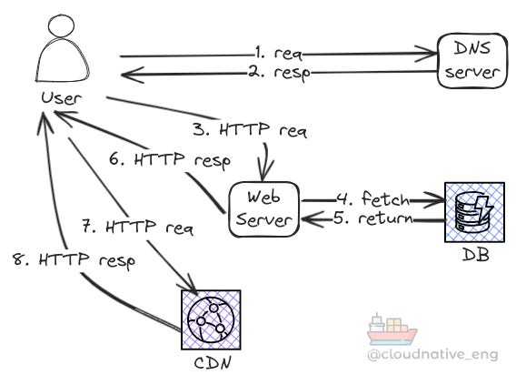
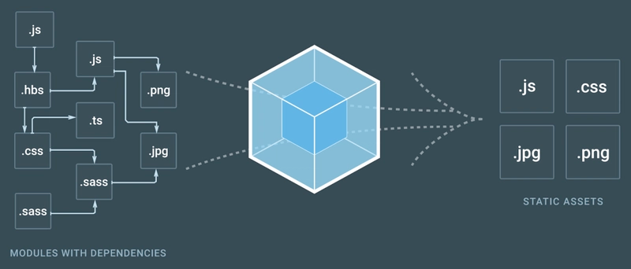

# React tanfolyam — 1. alkalom, elméleti bevezető

## Rövid cél

Ez az oldal rövid, gyakorlati összefoglalót ad a frontend fejlesztés alapjairól, a fontos koncepciókról, majd részletesebben bemutatja a React-et és a Next.js-t — miért használjuk őket és miben különböznek a „plain” JavaScript-től.

Ha bizonytalan vagy az alapokban, érdemes előbb elolvasni a _**[Webes alapok](/docs/webes-alapok/intro.md)**_ anyagot.

## Mi az a frontend?

A frontend az alkalmazás azon része, amit a felhasználó lát és használ: a böngésző futtatja (HTML/CSS/JavaScript), a kliens oldalon jeleníti meg az adatokat, és felhasználói interakciókat kezel.

Tipikus feladatok: UI megjelenítése, felhasználói események kezelése, backend API-k meghívása és a kapott adatok megjelenítése.

## Alapok: HTML, CSS, JavaScript

- HTML: a dokumentum szerkezete, DOM elemek (címek, bekezdések, űrlapok stb.).
- CSS: megjelenés és elrendezés — Box Model, Flexbox, Grid, stb.
- JavaScript: interaktivitás, DOM manipuláció, eseménykezelés és hálózati kérések.

Ezek együtt adják a klasszikus webfejlesztés alapját.

## Mi történik az URL beírása és az oldal megjelenése között?



## Fontos koncepciók

- DOM: a böngésző belső fa-struktúrája, amin a JS dolgozik.
- CSR (Client-Side Rendering): a böngésző tölti be és rendereli a JavaScriptet, az oldal dinamikusan épül fel a kliensoldalon.
- SSR (Server-Side Rendering): a szerver előre legyártja az HTML-t (gyorsabb első render), majd a kliens átveszi az interaktivitást.
- SPA (Single Page Application): egyetlen HTML betöltés után a JS frissíti a felületet, váltások a kliensoldalon történnek.

## Eszközök, amikkel gyakran találkozunk

A modern frontend fejlesztésben több olyan eszköz is segíti a napi munkát és a projekt skálázhatóságát, amelyek nem közvetlenül részei a HTML/CSS/JS triónak, de jelentősen megkönnyítik a fejlesztést és a deployment-et. Az alábbiakban részletesen ismertetjük a leggyakoribb kategóriákat, hogyan működnek nagy vonalakban, mire jók és mikor érdemes használni őket.

Bundlers (pl. Webpack, Vite, Rollup)

A bundler feladata, hogy a projekt különálló moduljait és assetjeit (JavaScript, CSS, képek, betűk stb.) egy vagy több optimalizált fájlba csomagolja a böngésző számára. A modern frontend-modulok gyakran ES-modulokat (import/export) használnak; a bundler elemzi a függőségi gráfot, és létrehozza a végrehajtáshoz szükséges bundle-okat. A bundlerek kínálta fontos funkciók:

- Modul-felbontás és dependency graph: automatikusan felderítik, mely fájlok kellenek, és hogyan kapcsolódnak egymáshoz.
- Kód-splitting / lazy loading: nagyobb alkalmazást kisebb darabokra bontanak, így csak a szükséges kód töltődik be (gyorsabb első oldalbetöltés).
- Tree-shaking: a nem használt kód eltávolítása a végső bundle-ból a kisebb fájlméretért.
- Asset kezelés: képek, fontok, CSS importok külön kezelése, optimalizálás és cache-barát elnevezések.
- Fejlesztői szerver és HMR (Hot Module Replacement): gyors fejlesztési ciklus, ahol a változtatások azonnal megjelennek újratöltés nélkül.

Webpack egy nagyon rugalmas, konfigurálható bundler; Vite modern alternatíva, amely fejlesztéskor gyors indulást és natív ES modulokat használ (gyorsabb HMR). Rollup jó választás könyvtárak csomagolásához (kisebb bundle-ok, ES module kimenet). A választás gyakran a projekt igényeitől és az ökoszisztémától függ.



Transpilers és típusellenőrzés (TypeScript, Babel)

A transpiler (pl. Babel) és a TypeScript két, de gyakran együtt használt eszköz: a Babel lehetővé teszi, hogy modern JavaScript szintaxist (pl. új nyelvi funkciókat) használjunk, de a kimenetet régebbi böngészők által értelmezhető kódra alakítja. A TypeScript pedig statikus típusellenőrzést ad a JavaScript fölé: egy fejlettebb fordító lépés során a .ts/.tsx fájlokból JavaScript lesz, és a fejlesztői időben sok típushibát kapunk vissza.

Miért hasznosak?

- Biztonságosabb kód: a TypeScript segít korán észrevenni típushibákat, javítva a fejlesztési sebességet és a karbantarthatóságot.
- Modern nyelvi szolgáltatások: async/await, optional chaining, nullish coalescing és más új dolgok használata anélkül, hogy a célkörnyezet ezt natívan támogatná.
- Tooling integráció: jobb IDE-támogatás, autocompletion, refaktorálás.

Általában a build pipeline-ban a bundler és a transpiler együtt működik: a bundler betölti a forrásfájlokat, a transpiler (vagy loader) átalakítja őket, majd a bundler elkészíti a végleges csomagokat.

CSS preprocessors (például SASS)

A CSS preprocesszorok olyan eszközök, amelyek kiegészítik a sima CSS-t programozási jellegű lehetőségekkel. A SASS (SCSS szintaxissal) a legismertebb példa. Mire jók?

- Változók: színek, méretek, breakpoints központi tárolása (`$primary-color`), így könnyebb a karbantartás.
- Beágyazás (nesting): logikailag összetartozó szelektorok egyszerűbb szerkesztése.
- Mixin-ek és függvények: ismétlődő stílusminták újrafelhasználása.
- Partials / importok: kisebb fájlokra bontva kezelhetőbb a stíluslap.

A preprocesszorok fordítása során a SASS/SCSS fájlok sima CSS-re transzformálódnak, majd a bundler vagy a CSS pipeline tovább optimalizálja (minify, autoprefixer stb.).

CSS frameworkök (pl. Bootstrap), illetve utility-first megoldások (pl. Tailwind)

A CSS frameworkök kész, előre megírt komponenseket és layout rendszereket adnak (pl. Bootstrap grid, gombok, űrlapok, modálok). Előnyeik:

- Gyors prototipizálás: szabványos osztálykészlet és komponensek használatával gyorsan felépíthető a felület.
- Konzisztencia: előre definiált design-sémák segítik az egységes megjelenést.

Hátrányok lehetnek: nagyobb alapméret, a testreszabás néha bonyolultabb, és a projekt jellegétől függően túl általános megoldást adhat.

Ezzel szemben a utility-first megközelítés (például Tailwind CSS) apró, egyszerű osztályokat ad, amiket komponensekhez kombinálva használunk. Előnyei:

- Finomabb kontroll a stílusok fölött, kevesebb egyedi CSS írásával.
- Jobb komponens-szintű izoláció és kisebb végleges CSS ha jól konfiguráljuk (purge / tree-shake a használaton kívüli osztályok eltávolítására).

Mikor mit válassz?

- Kis, egyszerű projektnél lehet elég a sima CSS vagy egy kisebb framework.
- Gyors prototípushoz és admin-felületekhez a Bootstrap hasznos lehet.
- Nagyobb, skálázódó projektekhez, ahol komponensenként szeretnénk kontrollt és kicsi végleges CSS-t, a Tailwind gyakran jobb választás.

Hogyan épülnek össze ezek az eszközök a gyakorlatban?

Egy tipikus modern frontend build pipeline lépései így néznek ki:

1. Forráskód (JS/TS, JSX/TSX, SASS/SCSS, képek) — fejlesztés a helyi gépen.
2. Transpilálás: TypeScript vagy Babel átalakítja a forrásokat kompatibilis JavaScript-re.
3. Bundling: a bundler (Webpack/Vite) összegyűjti a modult fákat, végrehajtja a code-splittinget és asset optimalizációt.
4. Optimalizáció: minimizálás, tree-shaking, cache-busting (hashes), képek optimalizálása.
5. Deployment: a kész, optimalizált bundle-ok kerülnek szerverre vagy CDN-re.

Miért érdemes ezekkel foglalkozni?

Ezek az eszközök segítenek abban, hogy a fejlesztés gyors és hibamentes legyen, a kód karbantartható maradjon, és a végfelhasználói élmény jó legyen (gyors betöltés, kisebb fájlok, jobb cache-elés). Csapatmunkánál és hosszútávú projektekben jelentősen csökkentik a fejlesztési költséget és növelik a kód minőségét.

## Miért váltunk át "plain" Javascript-ről framework-ökre?

A sima, natív DOM-manipuláció gyorsan bonyolulttá válik: sok boilerplate, manuális DOM-frissítések, állapot és UI szinkronizációja. Ezért jöttek a JS keretrendszerek (React, Vue, Angular), amelyek:

- komponens-alapú szerkezetet adnak (újrafelhasználhatóság),
- deklaratív módon írhatjuk le a UI-t (kevesebb DOM-kód),
- egységes mintát adnak az állapot és az mellékhatások kezelésére.

## React — mit ad, miért jó

Miben több, mint a sima Javascript?

- Deklaratív: leírod, hogyan nézzen ki a UI adott állapotban, a React végzi az egyezéshez szükséges DOM-frissítéseket.
- Komponensek: a UI részekre bontása egyszerűsíti a fejlesztést és tesztelést.
- Állapotkezelés: local state (useState), side-effect kezelése (useEffect), könnyebb adatáramlás.
- Virtual DOM: React egy könnyített belső reprezentációt használ a hatékony frissítéshez (diff + patch), így kevesebb és gyorsabb DOM-módosítás történik.

Előnyök röviden:
- Kevesebb hibás DOM-manipuláció, rendezettebb kód.
- Újrafelhasználható komponensek és komponens-kompozíció.
- Erős ökoszisztéma (router, forms, state management könyvtárak, stb.).

Egyszerű komponens példa:

```jsx
function Greeting({ name }) {
  return <h1>Sziasztok, {name}!</h1>;
}
```

Adatbetöltés useEffect-tel (összefoglaló példa):

```jsx
import { useState, useEffect } from 'react';

function List() {
  const [items, setItems] = useState([]);
  useEffect(() => {
    fetch('/api/items').then(r => r.json()).then(setItems);
  }, []);
  return <ul>{items.map(i => <li key={i.id}>{i.title}</li>)}</ul>;
}
```

## Plain JS vs React — gyakorlati példa

Az alábbi rövid példa jól szemlélteti a különbséget: a sima JavaScriptes megoldásnál nekünk kell manuálisan manipulálnunk a DOM-ot és eseményeket kötni, míg a React deklaratívabb és kevesebb fájdalommal jár.

Plain JavaScript (DOM manipuláció):

```html
<!-- index.html -->
<div id="app"></div>
<script>
  const app = document.getElementById('app');
  const items = [{ id: 1, title: 'Első' }];

  function render() {
    app.innerHTML = `
      <ul>${items.map(i => `<li>${i.title}</li>`).join('')}</ul>
      <input id="newItem" />
      <button id="add">Hozzáad</button>
    `;

    document.getElementById('add').addEventListener('click', () => {
      const v = document.getElementById('newItem').value;
      if (!v) return;
      items.push({ id: Date.now(), title: v });
      render(); // manuális újrarender
    });
  }

  render();
</script>
```

React (JSX + state):

```jsx
import { useState } from 'react';

function App() {
  const [items, setItems] = useState([{ id: 1, title: 'Első' }]);
  const [value, setValue] = useState('');

  const add = () => {
    if (!value) return;
    setItems(prev => [...prev, { id: Date.now(), title: value }]);
    setValue('');
  };

  return (
    <div>
      <ul>{items.map(i => <li key={i.id}>{i.title}</li>)}</ul>
      <input value={value} onChange={e => setValue(e.target.value)} />
      <button onClick={add}>Hozzáad</button>
    </div>
  );
}
```

Röviden: a Reactben nem kell innerHTML-t építeni vagy manuálisan eseményeket kötni minden új elemre — az állapot (state) és a JSX leírja, hogyan kell kinézzen a UI, a React pedig gondoskodik a DOM-frissítésről.

## Next.js — mit ad hozzá a React-hez?

Next.js egy React-alapú framework, ami magas szintű szolgáltatásokat hoz be a projektekbe:

- Routing és fájlrendszer-alapú oldalak (pages / app dir), egyszerűsíti az oldalfejlesztést.
- Támogatja az SSR-t és az SSG-t (statikus generálás), valamint az ISR-t (incremental static regeneration) — így jobb első render és SEO.
- API routes: egyszerű backend végpontok a projektben.
- Beépített optimalizálások: képek, kód-splitting, előtöltés.
- Kiadás/production workflow egyszerűbb: build és optimalizálás a framework része.

Mikor érdemes Next.js-t választani?
- Ha SEO, gyors első render vagy szerveroldali adatok fontosak.
- Ha szeretnénk konzisztens projektszerkezetet és beépített optimalizálásokat.

Miben különbözik a React-től?
- A React egy UI könyvtár; a Next.js egy teljes keretrendszer, ami a React-et használja alatta, és hozzáad routingot, SSR/SSG/ISR támogatást és egyéb infrastruktúrát.

## Hálózati kérések: fetch vs Axios (röviden)

- fetch: beépített böngésző API, egyszerű használat, Promise-alapú. Alap esetben kézi hibakezelés és JSON parsing szükséges.

```js
fetch('/api/items')
  .then(res => { if (!res.ok) throw new Error('Hiba'); return res.json(); })
  .then(data => console.log(data));
```

- Axios: népszerű külső könyvtár, kényelmesebb API (automatikus JSON parsing, interceptors, timeout kezelés), Node és böngésző környezetben is azonos viselkedés.

```js
import axios from 'axios';
const { data } = await axios.get('/api/items');
```

Mindkettő jó; kis projektekben a `fetch` elegendő, nagyobb igényeknél az Axios extra kényelmi és konfigurációs lehetőségei hasznosak.

## Összefoglaló — mit vigyél magaddal

- Ismerd meg az alapokat: HTML, CSS, JS és DOM.
- A bundlerek, transpiler-ek és CSS eszközök segítik a skálázást (Webpack, TypeScript, SASS, Bootstrap).
- Plain JS hamar bonyolult lesz nagyobb UI-k esetén — ezért érdemes frameworköt választani.
- React egyszerűsíti a komponens-alapú fejlesztést és a hatékony DOM-frissítést.
- Next.js hozzáad szerveroldali renderelést, routingot és egy csomagolási konvenciót, ami gyorsítja a fejlesztést és javítja az UX/SEO-t.
- Hálózati kérésekhez `fetch` működik, Axios extra funkcionalitást ad.
