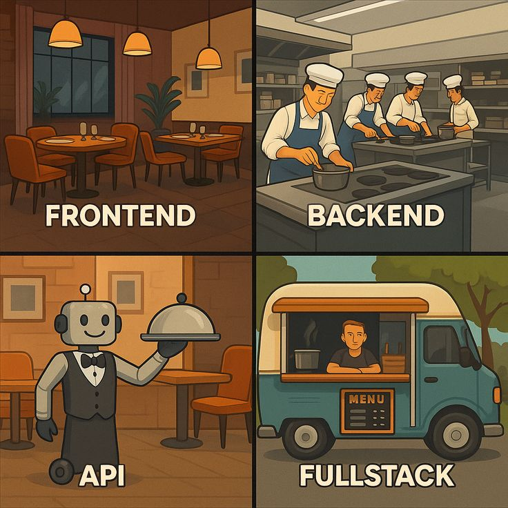
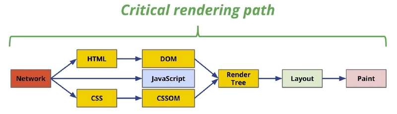
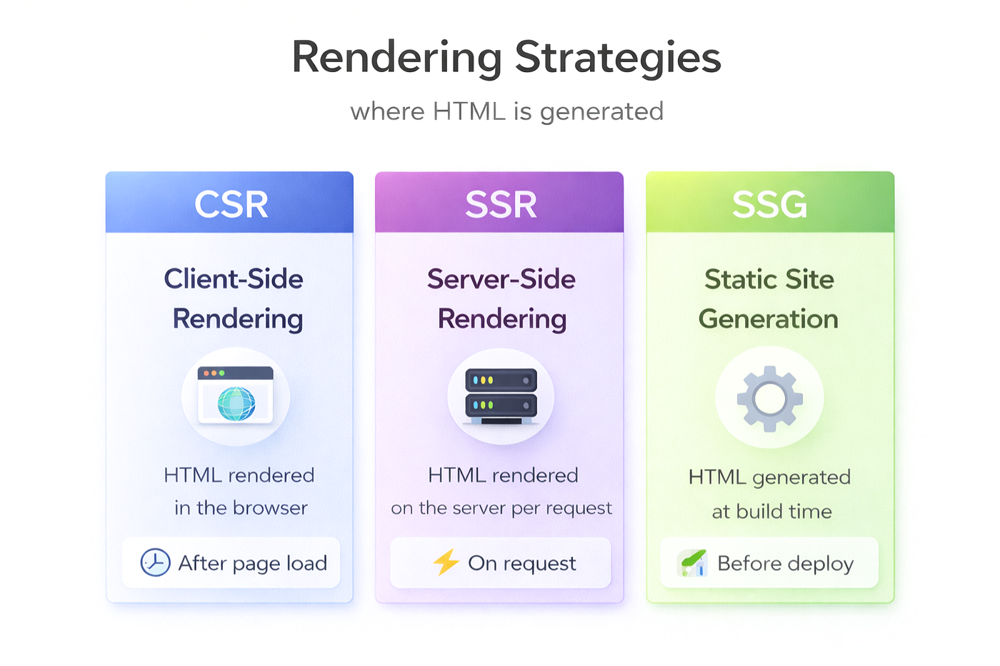

import TypeScriptSvg from '../../static/img/react/typescript.svg';
import VueSvg from '../../static/img/react/Vue.js_Logo_2.svg';

# React tanfolyam — 1. alkalom, elméleti bevezető

Üdvözlünk a Kir-Dev React és frontend tanfolyamán! Ez a tanfolyam épít a korábbi képzéseinkre, amelyeket megtalálsz a [tanfolyamaink weboldalán](https://tanfolyam.kir-dev.hu/homepage). Ha valamelyik alapfogalom (mint a HTML, CSS, JavaScript vagy a Node.js) új számodra, érdemes átnézni a korábbi anyagokat, mert ezekre fogunk támaszkodni, de igyekeztünk mindent a szükséges mértékben összefoglalni az alábbiakban.

Ez az oldal részletes, elméleti bevezetőt ad a frontend fejlesztés világába, hogy megértsük, _miért_ alakult ki a jelenlegi ökoszisztéma, és hogyan jutottunk el a sima fájlok szerkesztésétől a modern keretrendszerekig, mint amilyen a React is.

---

## Mi az a frontend?

A szoftverfejlesztésben a **frontend** az alkalmazások azon része, amivel a felhasználó közvetlenül interakcióba lép. Ez az a grafikus felület, adathalmaz és logika, ami magában a felhasználó eszközén (jellemzően a webböngészőben) fut, szemben a **backend**del, ami a távoli szervereken dolgozik az adatok feldolgozásán és tárolásán.

A frontend fejlesztő feladatai közé tartozik a felhasználói felület (UI) megjelenítése, a felhasználói interakciók (kattintások, gépelés) kezelése, és a backend API-kkal való kommunikáció (adatok lekérése, küldése).



## Hogyan működik a web?

A weben az adatcsere kliens (böngésző) és szerver között zajlik le. Amikor beírsz egy URL-t a böngésződbe:

1. A böngésző feloldja a domain nevet (DNS).
2. HTTP/HTTPS kérést küld a szervernek.
3. A szerver feldolgozza a kérést, és visszaküldi a választ (általában egy HTML dokumentumot, statikus fájlokat vagy adatokat JSON formátumban).

_(Erről részletesebben a [NodeJS tanfolyamon](https://tanfolyam.kir-dev.hu/docs/node-js/intro#hogyan-kommunik%C3%A1l-a-frontend-%C3%A9s-a-backend) volt szó, ahol a szerveroldali működést vizsgáltuk meg.)_

## Alapok: HTML, CSS, JS

Ahhoz, hogy webes felületeket építsünk, alapvetően három technológiára van szükségünk. Ezek jelentik a weblapok építőköveit. A [Webes alapok tanfolyamunkon](https://tanfolyam.kir-dev.hu/docs/webes-alapok/intro) részletesen is végigmentünk ezeken, így most csak ismétlésképpen:

- **HTML (HyperText Markup Language):** Ez adja a weblap _struktúráját_ és _tartalmát_. Segítségével definiáljuk az oldal elemeit: mik a bekezdések, címsorok, képek, hivatkozások.
- **CSS (Cascading Style Sheets):** A _megjelenésért_ felel. Itt határozzuk meg a színeket, az elrendezést (Box Model, Flexbox, Grid), betűtípusokat és animációkat.
- **JavaScript (JS):** A _viselkedésért_ és az _interaktivitásért_ felel. JS segítségével tudjuk a letöltött lapot manipulálni, eseményekre reagálni, és új adatokat letölteni anélkül, hogy az egész weblapot újra kellene tölteni.

Ezek a klasszikus webfejlesztés alapjai. A böngészők natívan ezt a három technológiát értik meg.

## A böngésző működése

Amikor a böngésző megkapja a fent felsorolt fájlokat, több lépésben alakítja át őket azzá a vizuális weblappá, amit a képernyőn látsz.

1. **DOM (Document Object Model):** A böngésző elemzi a HTML fájlt, és felépít belőle egy fastruktúrát a memóriában. Minden HTML címke (tag) egy csomópont (node) lesz ebben a fában. Ez a DOM, amihez a JavaScript később hozzáférhet, hogy módosítsa azt.
2. **CSSOM (CSS Object Model):** Hasonlóan a HTML-hez, a böngésző a CSS fájlokat is feldolgozza, és felépíti belőlük a CSSOM fát, ami a stílusszabályokat tartalmazza minden egyes elemre vonatkozóan.
3. **Render Tree:** A böngésző fogja a DOM-ot és a CSSOM-ot, majd összekombinálja őket egy úgynevezett Render Tree-vé. Ez a fa már csak azokat az elemeket tartalmazza, amelyeket ténylegesen meg is kell jeleníteni a képernyőn (tehát például egy `display: none` css szabállyal rendelkező elem ebbe már nem kerül bele).
4. **Layout és Paint (Screen):** A Render Tree alapján a böngésző kiszámolja a pontos pixelpozíciókat (Layout), majd "kifesti" (Paint) az elemeket a képernyőre.



A **DOM + CSSOM = Render Tree ⇒ Screen** folyamat a böngésző lelke.

## Rendering modellek

Ahhoz, hogy megértsük a React-et, látnunk kell, hogyan változott a weblapok renderelésének (megjelenítésének) a módja az évek során. Három fő modellt érdemes megkülönböztetni.

### SSR (Server-Side Rendering, szerveroldali renderelés)

A web hajnalán – és ma is sok hagyományos keretrendszerben, mint amikről a [backend tanfolyamainkon](https://tanfolyam.kir-dev.hu/homepage) tanultunk (például **Spring Boot**) – a renderelés a szerveren történik.

- **Folyamat:** A böngésző (Browser) kér egy oldalt a szervertől (Server) egy Request formájában. A szerver az adatbázisból megszerzi az adatokat, beleilleszti egy HTML templétbe, majd a _kész HTML-t_ küldi vissza a böngészőnek.
- **Jellemzője:** Minden egyes navigáció (amikor egy linkre kattintasz) egy teljesen új oldalbetöltést jelent: a böngésző törli a régi HTML-t és letölti az újat. Ez a klasszikus SSR-re igaz, de a modern keretrendszereknél (pl. Next.js) már nem feltétlenül jelent minden esetben teljes oldalbetöltést a hibrid megoldások miatt.

### CSR - Client-Side Rendering (SPA)

A React modellje, itt jön képbe a kliensoldali renderelés (Client-Side Rendering), ami a modern JavaScript framework-ök (mint a **React**, Vue, Angular) alapvető működési elve.

- **Folyamat:** Amikor a felhasználó megnyitja az oldalt, a böngésző letölt egy minimális, szinte üres HTML fájt, és vele együtt egy (vagy több) nagy **JavaScript appot** (bundle fájlt). Ezt követően ez a letöltött **JavaScript rendereli (építi fel) az oldalt** a felhasználó böngészőjében, belenyúlva a DOM-ba. Ha adatra van szükség, a JS aszinkron API hívásokat (fetch/axios) tesz a szerver felé, de csak JSON adatokért, nem teljes HTML-ért.

- **Jellemzője:** Navigációkor **nem töltődik le új HTML** az oldalról. Csak a JavaScript cseréli ki a képernyőn látható elemeket. Ezért "Single Page", mert technikailag végig az az egyetlen HTML fájl van betöltve, amire rámentünk, csak a tartalom változik dinamikusan – így asztali alkalmazás (desktop app) jellegű, rendkívül gyors felhasználói élményt (UX) biztosít.

### Hibrid modell (SSR + CSR + SSG) → Next.js (későbbi téma)

Csak érintőlegesen megemlítve: a tisztán SPA modellnek vannak hátulütői (pl. lassabb első betöltés, rosszabb SEO/keresőoptimalizálás).
Ezért léteznek React-re épülő "meta-frameworkök", mint a Next.js, amik kombinálják a megközelítéseket:

- **SSR:** Bizonyos adatokat már szerveroldalon belerenderelnek a HTML-be kérőnként.
- **CSR:** De az oldal utána SPA-ként viselkedik tovább a böngészőben.
- **SSG (Static Site Generation):** Egyes oldalakat már "build time"-ban (fordításkor) előre legenerálnak statikus HTML-lé a maximális sebességért.



## Miért léteznek (frontend) frameworkok?

Visszautalva az oktatott backend keretrendszereinkre (Spring Boot, NestJs): ahogy a backend világban is azért használunk frameworköket, hogy ne nekünk kelljen nulláról megírni az alapvető webszerver működést, útválasztást és adatbázis-kapcsolatokat, úgy a frontenden is elértük ezt a pontot.

Közönséges, **JavaScripttel kódot írni egy idő után "fájdalmas"**, ha egy nagy, interaktív applikációt készítünk. Manuálisan kikeresni elemeket `document.getElementById`-val, eseményfigyelőket rákötni, majd amikor az adat (state) változik, manuálisan frissíteni a DOM minden érintett pontját... ez rengeteg hibalehetőséget, "spagetti kódot" és karbantarthatatlan projektet eredményez.

**A megoldás: JS Frameworks.** Ezen problémák megoldására születtek az olyan eszközök, mint a React, a Vue és az Angular.

<div style={{textAlign: 'center'}}>
  
  
  <VueSvg role="img" width="30%" height="30%"/>
</div>

---

## React alap koncepciók

A React elsőnek 2013-ban jelent meg a Meta (akkor még Facebook) jóvoltából, open source projektként. Jelenleg a 19-es major version-nél tart és a legnépszerűbb frontend könyvtár webes és egyben natív UI-k készítéséhez. Fő megközelítése, hogy a felhasználói felületet deklaratívan állítsuk elő az aktuális állapotok (state) alapján.

#### SPA (Single Page Application)

_Lásd: [Renderelési stratégiák, CSR](#csr---client-side-rendering-spa)_

#### JSX (JavaScript XML) és Markup írása

A React bemutatott egy teljesen új szintaxist, a JSX-et.

- **Mi ez?** Egy HTML-szerű szintaxis _egyenesen a JavaScript kódodon belül_.
- **Valójában JS:** Bár úgy néz ki, mint a HTML, a JSX valójában a háttérben puszta JavaScript függvényhívásokká alakul át. Szóval HTML-t írhatunk benne, de közben használhatjuk a JS teljes erejét!
- **Szigorúbb, mint a HTML:** A JSX-ben minden taget kötelező bezárni (pl. `<br />` önzáró elemek esetén), és egy komponens **nem adhat vissza több független gyökérelemet**. Ha több HTML taget akarsz visszaadni, mindig bele kell csomagolnod egy közös szülő elembe, például egy `<div>...</div>`-be, vagy egy üres `<>...</>` (Fragment) burkolatba.

Példa:

```tsx
function AboutPage() {
  return (
    <>
      <h1>Rólunk</h1>
      <p>
        Helló!
        <br />
        Hogy vagy?
      </p>
    </>
  );
}
```

#### TSX (TypeScript XML) — Amikor a JSX találkozik a TypeScripttel

A webes projektek – mint ahogyan a saját tanfolyami feladataink is – jellemzően már túlmutatnak a sima gyengén típusos JavaScript kódokon. Helyette **TypeScript**-et használunk, ami behoz egy fordítási időben történő (fordítóprogram által ellenőrzött) erős típusrendszert. Ennek a kiterjesztése a React világában a `.tsx` fájlformátum.

A TSX lényegében ugyanazt az XML formátumú JSX-et engedi írni, de ezúttal **fel is ruházhatjuk a komponenseink és változóink paramétereit (props) egyértelmű típusokkal (Type / Interface)**. Ez óriási segítség az IDE (mint a VSCode) számára: a kódszerkesztő rögtön aláhúzza pirossal, ha például véletlenül egy számot próbálnál átadni egy olyan komponensnek, ami szöveget vár, valamint tökéletes auto-complete felajánlásokat kapsz! Ezentúl a példákban is a `tsx`-et (TypeScriptes megközelítést) használjuk.

#### Komponens hierarchia és komponens alapú gondolkodás

A React szívében a **komponensek** állnak. Mint az informatika sok más területén, így itt is érdemes úgy elképzelni, mintha Lego kockákból építkeznénk. Nem egyetlen hatalmas kódban írjuk le a weboldalt, hanem apró, önálló, **újrahasználható UI egységekre** bontjuk, mint például egy "Gomb", egy "Fejléc" vagy egy "Felhasználói profil kártya". Ezek a komponensek aztán egymásba ágyazhatók, így egy fát (hierarchiát) alkotva építik fel a teljes alkalmazást.

Gyakorlatban a React komponensek olyan JavaScript függvények, amelyek megjeleníthető kódot (markup-ot) adnak vissza.
Fontos szabály: **A React komponensek neveit mindig nagybetűvel kell kezdeni**, míg a sima HTML tagek kisbetűsek!

```tsx
// Gomb komponens definiálása
function MyButton() {
  return <button>Kattints rám!</button>;
}

// A Gomb komponens beágyazása a fő alkalmazásba
export default function MyApp() {
  return (
    <div>
      <h1>Üdvözöllek az alkalmazásomban</h1>
      {/* Itt ágyazzuk be az egyedi komponensünket */}
      <MyButton />
    </div>
  );
}
```

#### Adatok megjelenítése és stílusok hozzáadása

A TSX-ben a **kapcsos zárójelek `{}`** segítségével tudunk "visszaugrani a JavaScript világába". Bármilyen JavaScript változót, vagy akár összetett kifejezéseket is megjeleníthetünk velük, vagy átadhatunk attribútumként (pl. `src` egy képhez).
Fontos még, hogy a CSS osztályokat a HTML-ben megszokott `class` helyett TSX-ben a **`className`** attribútummal adhatjuk meg!

```tsx
// Egy interface-ben definiálhatjuk milyen adatok érkezhetnek kötelezően a user objektumba
interface User {
  name: string;
  imageUrl: string;
}

const user: User = {
  name: 'Kir-Dev',
  imageUrl: 'https://kir-dev.hu/profile/img.png',
};

export default function Profile() {
  return (
    <>
      <h1>{user.name}</h1>
      {/* Változók alkalmazása attribútumként a {} segítségével */}
      
    </>
  );
}
```

#### Feltételes renderelés (Conditional Rendering)

A Reactban nincs különleges, saját szintaxis a feltételekre. Ugyanazokat az eszközöket használhatod, mint a sima JavaScriptben (pl. `if...else` utasítások). Ha azonban rövidebb, kifejezőbb kódot szeretnél, gyakran alkalmazzuk a **ternáris operátort (`feltétel ? igaz : hamis`)** vagy a **logikai és (`&&`) operátort** közvetlenül a TSX-en belül.

```tsx
// Itt definiáljuk a prop típusokat
interface AppPanelProps {
  isLoggedIn: boolean;
}

function AppPanel({ isLoggedIn }: AppPanelProps) {
  // Ha be vagyunk jelentkezve, az admin panelt mutatjuk, amúgy a bejelentkezőt
  return (
    <div>
      {isLoggedIn ? <AdminPanel /> : <LoginForm />}

      {/* Csak akkor mutatunk egy elemet (a && utáni részt), ha a feltétel maga igaz volt */}
      {isLoggedIn && <button>Kijelentkezés</button>}
    </div>
  );
}
```

#### Listák renderelése

Listák vagy adatok tömbjének megjelenítéséhez a JavaScript beépített **`map()`** függvényét használjuk, amivel a JS objektumainkból csinálunk olyan tömböt, ami TSX HTML elemeket (például `<li>` elemeket) tartalmaz.
Ilyenkor a React elvárja, hogy a listában legkívül lévő HTML elemnek (mint a példában a `<li>`) adjunk egy **egyedi `key` (kulcs)** attribútumot (például egy adott ID-t az adatbázisból). Ebből fogja tudni hatékonyan a React a renderelés során, hogy pontosan melyik elemhez nyúltunk, ha mondjuk egy rekord később törlődik, módosul, vagy átrendeződik.

```tsx
interface Product {
  title: string;
  id: number;
}

const products: Product[] = [
  { title: 'Káposzta', id: 1 },
  { title: 'Fokhagyma', id: 2 },
  { title: 'Alma', id: 3 },
];

export default function ShoppingList() {
  const listItems = products.map((product) => <li key={product.id}>{product.title}</li>);

  return <ul>{listItems}</ul>;
}
```

#### Események (Events) kezelése

A Reactban könnyedén reagálhatsz felhasználói interakciókra, ha függvényeket (eseménykezelőket vagy _event handlereket_) adsz át az egyes TSX elemek esemény-attribútumainak (mint például `onClick`).
Fontos figyelmeztetés: **soha ne hívd meg a függvényt** a zárójelekkel rögtön maga az attribútum átadásakor (ne `onClick={handleClick()}` legyen)! Te magát a függvényt adod át referenciaként a React számára, hogy _ő_ tudja meghívni ha például a felhasználó mondjuk odajut, hogy rá is kattintson.

```tsx
function MyButton() {
  // TypeScriptben a void (visszatérés nélküli) függvényt és eseménykezelőt is könnyebb azonosítani
  function handleClick(): void {
    alert('Rám kattintottál!');
  }

  // JÓ: onClick={handleClick}
  // ROSSZ: onClick={handleClick()} -> rögtön lefutna már az oldal betöltésekor
  return <button onClick={handleClick}>Kattints ide</button>;
}
```

#### Props (Tulajdonságok)

A `props` (properties röviden) segítségével tudunk **adatokat átadni komponensek között**, méghozzá mindig fentről lefele (a szülő komponenstől a gyerek komponens felé). Olyanok ezek, mint a paraméterek egy függvénynél. És ami nagyon fontos: a props-okat a React mindig "read-only"-ként (olvasásra szánt adatként) értelmezi, azaz a gyermek komponens közvetlenül nem módosíthatja a kapott értéket.
A TSX előnye, hogy ezekhez a props objektumokhoz pontos Interface-eket adhatunk meg!

Példa:

```tsx
// Definiáljuk, hogy miket vár a gyerek komponens!
interface WelcomeProps {
  name: string;
}

// A Welcome (a gyerek) komponens vár egy 'name' nevezetű propot paraméterként
function Welcome({ name }: WelcomeProps) {
  return <h1>Szervusz, {name}!</h1>;
}

// Így használjuk (a szülőben):
function App() {
  return <Welcome name='Béla' />; // Megkapja és kiírja: "Szervusz, Béla!"
}
```

#### State és Hooks megismerése

Míg a `props` kívülről jön, a **state változó a komponens belső, saját memóriája/állapota**. Amikor egy app egy interakcióra reagál – például a felhasználó rákattint egy gombra –, valójában a `state`-et módosítja. Ha a **state változik → re-render** (újrarenderelés) történik az adott React elemben. A változó UI alapelve: **A felhasználói felület pusztán az állapot/adatok vizuális leképezése, függvénye egy adott pillanatban** (UI = f(state)).

A React elemekbe úgynevezett "Hook" (horog) függvényekkel tudunk "beleakaszkodni", hogy extra React funkciókat (mint a state-ek, hivatkozások kezelése) tudjunk alkalmazni rajtuk a sima megjelenítésen kívül. A hookok nevében kiemelt "szabály", hogy mindig a `use` szóval kezdődnek.

A leggyakrabban használt Hook a **`useState`**, ami lehetővé teszi, hogy emlékezzen a komponens az aktuális állapotára a "renderelések" között is. A Hook meghívása minden alkalommal létrehoz számunkra egy tömböt, aminek a nulladik eleme maga az értékváltozó, míg az első eleme az a függvény, amivel később felül is tudjuk írni ezt az értéket.

```tsx
import { useState } from 'react';

function Counter() {
  // count: jelenlegi érték (kezdetben legelőször megkapja a 0-át)
  // setCount: ő meg itt a függvény amivel majd felülírhatjuk a state-et
  // A TypeScript okos: a "0" számból magától ki is találja (kikövetkezteti/infereli), hogy a type "number" lesz!
  const [count, setCount] = useState(0);
  // Természetesen ki is köthetjük explicit: const [count, setCount] = useState<number>(0);

  function handleClick(): void {
    // Állapot frissítése! Ennek a függvénynek a lefutása után
    // a React újrafuttatja ezt az egész függvényt (újrarajzolván a komponenst)
    setCount(count + 1);

    // Szakmai tipp! Ha az új érték az előző értékből számítódik ki, sokszor
    // biztonságosabb a "callback" paraméteres változatot használni, ami a mindenkori
    // legfrissebb állásból indul ki (különösen aszinkron és gyakori hívásoknál):
    // setCount((prevCount) => prevCount + 1);
  }

  return <button onClick={handleClick}>A gombra {count} alkalommal kattintottál!</button>;
}
```

Ha egy komponenst többször is leteszel a felületen (`<Counter />` majd egy másik `<Counter />` alatta), **mindegyik példány teljesen megtartja a saját, a többitől független state-jét, Counterjét**. Egyik módosítása nem hat a másikra!

Ezen felül további két nagyon gyakori Hook-kal fogsz még sokat találkozni:

Az **`useEffect`** Hook az úgynevezett mellékhatások (side effects) és szinkronizációs folyamatok kezelésére való. Ezek olyan folyamatok, amelyek a komponens _megjelenítése (a DOM frissítése) UTÁN_ futnak le a háttérben – tehát nem akasztják meg a képernyő kirajzolását. Ilyen például egy hálózati API hívás (adatszerzés), egy eseményfigyelő feliratkozása (pl. görgetés vagy billentyűzet-figyelés), vagy egy időzítő (`setTimeout`) indítása.
A `useEffect` két paramétert vár: egy függvényt (a callbacket), ami magát a mellékhatást tartalmazza, és egy "dependency array"-t (függőségi tömböt), amelynek segítségével pontosan megadhatjuk a React számára, hogy mely változók tartalmának módosulásakor fusson le _újra_ ez a hatás.

> 💡 **Fejlesztői Tipp (React 18 Strict Mode):** Az induláskor gyakran fogod azt tapasztalni fejlesztés közben, hogy a `[]` üres tömbös, "csak egyszer" lefutó hookjaid (és így hálózati kéréseid is) egymás után **kétszer** meghívódnak a legelső oldalbetöltéskor. Ez nem elírás és nem is hiba oldaladról! A React (kizárólag fejlesztői módban) szándékosan leteszi, kiveszi, majd újra leteszi a komponenst, hogy ellenőrizze, nem felejtettél-e el letakarítani szálakat a hatások legvégén. Élesítéskor ez a viselkedés eltűnik!

```tsx
import { useState, useEffect } from 'react';

interface FetchData {
  title: string;
}

function DataFetcher() {
  // Kikötjük az állapotnál, hogy az értékünk vagy a FetchData típus egyede lesz, vagy null
  const [data, setData] = useState<FetchData | null>(null);

  useEffect(() => {
    // Ez a függvény (a "hatás") csak egyszer fog lefutni a legelején (mount),
    // mert a második paraméterként egy üres tömböt [] adtunk meg.
    fetch('https://api.example.com/data')
      .then((res) => res.json())
      .then((d: FetchData) => setData(d));
  }, []);

  return <div>{data ? `Adat betöltve: ${data.title}` : 'Valami tölt...'}</div>;
}
```

A **`useContext`** Hook pedig arra nyújt megoldást, hogy globális vagy központibb adatokat (például az aktuálisan bejelentkezett felhasználót, a nyelvi beállításokat, vagy egy Light/Dark témát) ne kelljen "prop drilling"-gel, feleslegesen rengeteg szinten keresztül passzolgatni komponensről komponensre. A React "Context" lényegében egy láthatatlan csatorna a fában, ahová a szülő berak ("provide") egy adatot, és azt bármelyik sokkal lejjebb lévő gyermeke közvetlenül ki is tudja onnan olvasni ("consume").

```tsx
import { createContext, useContext, useState } from 'react';

// Csinálunk egy típust a lehetséges témáknak
type ThemeValue = 'light' | 'dark';

// 1. Context létrehozása explicit típus megadásával
const ThemeContext = createContext<ThemeValue>('light');

// 2. A Szülő biztosítja (kínálja / provide-olja) az adatot a fának.
function App() {
  const [theme, setTheme] = useState<ThemeValue>('dark');
  return (
    // Innentől kezdve ezen Provider alatti MINDEN komponens láthatja a témát!
    <ThemeContext.Provider value={theme}>
      <Layout />
    </ThemeContext.Provider>
  );
}

// 3. A fa alján (anélkül, hogy a propokat kapott volna) egy gyerek kiolvashatja
function ThemeButton() {
  // A TSX itt is okos és már tudni fogja, hogy leghátul 'light' | 'dark' a visszatérő érték ezen a Contexten
  const currentTheme = useContext(ThemeContext);
  return <button className={`btn-${currentTheme}`}>Aktuális téma: {currentTheme}</button>;
}

// Csak hogy lássuk, hogy a Layoutnak még csak tudnia sem kell a témáról:
function Layout() {
  return (
    <div>
      <ThemeButton />
    </div>
  );
}
```

#### Közös állapottér használata (Sharing Data / Lifting State Up)

Gyakran szükség van rá, hogy két vagy több komponens _ugyanazt_ az adatot (state-et) lássa és együttesen használja fel, illetve együtt is frissüljenek módosításkor.
Ha például azt szeretnéd, hogy a fenti Counter gombok a saját privát állásuk helyett egy közös értéken osztozzanak, akkor **ki kell emelned az állapotukat ("lifting state up")**. Ezt úgy teheted meg, hogy az állapotot tároló és módosító `useState`-et áthelyezed az egyes gombokból fel a legközelebbi közös szülő komponensükbe, és be kell juttatni (prop-ként átpaszírozva) le a gomboknak a szülőben meghatározott értéket is, valamint magát a befrissítő függvényt (az eseménykezelőt is felhúzva)!

Szülő komponens:

```tsx
import { useState } from 'react';

export default function MyApp() {
  const [count, setCount] = useState(0);

  function handleClick() {
    setCount(count + 1);
  }

  return (
    <div>
      <h1>Gombok amik közösen frissülnek itt a szülő alatt:</h1>
      {/* Az állapot értékét és a frissítést végző függvény is átadjuk propként! */}
      <MyButton count={count} onClick={handleClick} />
      <MyButton count={count} onClick={handleClick} />
    </div>
  );
}
```

Gyermek komponens:

```tsx
// Itt kötelező definiálni mit is kapunk pontosan prop objektumként
interface MyButtonProps {
  count: number;
  onClick: () => void; // Egy void függvény!
}

// Itt már nincs saját state (mert szülő tudja)! Csak property paraméterként megkapjuk (destrukturálva)
function MyButton({ count, onClick }: MyButtonProps) {
  return <button onClick={onClick}>Közösen {count} alkalommal kattintottatok ránk idáig!</button>;
}
```

#### React ≠ DOM manipuláció

A React koncepciójának a végső lényege az, hogy egy magasabb szintű absztrakciót képez és **teljesen elrejti előlünk a közvetlen DOM manipulációt** (azokat a feladatokat amik a native JavaScript-ben kifejezetten fájdalmasan bonyolult és nehezen követhető kódhoz vezettek el, mint a `document.getElementById` hívogatása vagy az állandó node-fa szintű elem beszúrása).

A React nem egy puszta DOM lekérdező manipulációs könyvtár mint a népszerű jQuery éveken át, hanem a **UI deklaratív leírása a statek alapján**.
Fejlesztőként te csak leírod az adatokat és azok vizuális megjelenő logikáját, a React pedig a háttérben egy **Virtual DOM** nevű saját memóriabeli modellt használ (napjainkban a React Fiber architektúrájára építve). Amikor egy állapot megváltozik, a React létrehoz a módosításokkal egy új "virtuális lenyomatot", majd összehasonlítja az azt megelőző változattal. Egy elképesztően okos "diff" (különbségkereső) algoritmus segítségével pontosan kiszámítja, hogy a felületen _milyen tényleges, minimális eltéréseket_ kell valójában frissítenie - például felismervén, hogy te csak "hozzáadtál 1 dolgot a listához". Ezután pusztán ezt az egy apró DOM elemet módosítja a sokkal lassabb valódi böngésző natív struktúráján, elkerülvén a teljes képernyő újrarenderelését. Ezzel drasztikus renderelési sebességet nyerünk fejlesztőként anélkül, hogy mikromenedzselnünk kellene a DOM elemek élettartamát!

---

## Modern frontend ökoszisztéma

Ma már nem csak abból áll egy frontend projekt, hogy létrehozunk 3 darab fájlt: egy `index.html`-t, egy `style.css`-t és egy `script.js`-t. Ez rendkívül gyorsan átláthatatlanná válna, főként csapatban és komplexitás növekedésével. Az alábbiakban végigmegyünk a legjellemzőbb problémákon és az ezekre született modern megoldásokon.

### Typescript

Mivel a JS gyengén típusos nyelv, könnyű elfelejteni egy objektum szerkezetét, emiatt futásidőben ("amikor a user már rákattintott") lépnek fel váratlan hibák.
**Megoldás: Transpilerek (TypeScript)**
A _TypeScript_ a JavaScript típushű kiterjesztése. (A [NodeJs tanfolyamon](https://tanfolyam.kir-dev.hu/docs/node-js/intro) volt szó róla részletesen). Segítségével már fordítási/fejlesztési időben elcsípjük a hibákat az IDE-ben. A kódot azonban a böngészők nem értik közvetlenül, ezért egy fordítónak (Transpiler) kell azt "sima" JavaScript-é alakítani még a feltöltés előtt. Erről a folyamatról lentebb írunk részletesebben.

<div style={{textAlign: 'center'}}>
  <TypeScriptSvg role="img" width="30%" height="30%"/>
</div>

### Package managers

Be tudunk húzni könyvtárakat `<script>` tagekkel, de ezek verzióinak kezelése, és egymástól való függésük egy rémálom, gyakran vezet globális változó ütközéshez és frissítési káoszhoz.
**Megoldás: Package Manager (`npm` / `yarn` / `pnpm`)**
eszközök, amik kezelik a projektünk külső függőségeit (dependency), nyilvántartják melyik könyvtárból pontosan melyik verzióra van szükségünk, és mindet egy felügyelt `node_modules` mappába töltik le. Ezzel már szintén találkozhattatok a [NodeJs tanfolyamon](https://tanfolyam.kir-dev.hu/docs/node-js/intro).

<div style={{textAlign: 'center'}}>
  
</div>

### Bundlers

Ha van 500 darab kisebb JS fájlunk modulokra bontva, a böngészőnek ennyi hálózati kérést kéne nyitnia értük ami eszméletlen lassú. Ráadásul a böngésző nem érti a React-os TSX szintaxist, a TypeScript-et vagy a legújabb JS funkciókat, azokat tehát "le kell fordítani".
**Megoldás: Bundlerek (csomagolók, pl. WebPack)**
A Bundler (mint a WebPack, vagy az újabb megoldás, a _Vite_) végigmegy az egész projekt gráfján, lefordítja a TypeScript-et/TSX-et hagyományos JavaScriptre, tömöríti a kódot, és egy-két optimalizált, böngészőnek már könnyen emészthető nagy fájlba (bundle) csomagolja az egészet!

<div style={{textAlign: 'center'}}>
  
</div>

### CSS frameworks

Nincsenek jó változók, nesting (egymásba ágyazás), a globális névtér miatt könnyű felülírni más fájlok stílusait, és sokszor kell ismételni kódokat vagy új class nevekkel izzadni (pl. `.wrapper-container-inner-item-content`).
**Megoldás: CSS Preprocessor (SASS) és Utility Frameworkök (TailwindCSS)**

| Kategória / Eszköz | Mire jó, mire használjuk? |
| :--- | :--- |
| **CSS++ (Stílus fókusz)** | **Tailwind, SAAS:** Elsősorban a vizuális megjelenítésért felelnek, rugalmas stílusozást tesznek lehetővé mélyebb logikai kötöttségek nélkül. |
| **Behaviour Libraries** | **Radix, HeadlessUI, React Aria:** Úgynevezett "fej nélküli" könyvtárak. A működést (pl. hogyan nyílik egy legördülő menü) adják meg, a kinézetet teljesen ránk bízzák. |
| **Style Systems** | **DaisyUI, Bootstrap, TailwindUI:** Előre elkészített dizájn-sablonok és stíluscsomagok, amelyekkel nagyon gyorsan építhető látványos felület. |
| **Metszetek (Hibridek)** | **ChakraUI, Mantine, MUI:** A "mindenesek". Egyszerre adnak kész stílust és beépített logikát/viselkedést a komponenseknek. |
| **Ajánlott kombináció** | **Tailwind + shadcn/ui:** Jelenleg az egyik legnépszerűbb párosítás; a Tailwind adja a stílust, a shadcn pedig a Radix-ra épülő, másolható és testreszabható komponenseket. |
| **Kezdőknek ajánlott** | **ChakraUI:** Kiváló választás tanuláshoz és gyors prototípusgyártáshoz, mert logikus a felépítése és sok terhet levesz a fejlesztő válláról. |

<div style={{textAlign: 'center'}}>
  
</div>

A klasszikus utód a _SASS_, ami változókat, mixineket, és egyszerűbb hierarchikus struktúrát engedett írni CSS kódokba. A legmodernebb ipari szabvány és kedvenc azonban jelenleg a **TailwindCSS**, ami a "Utility-first" megközelítést alkalmazza.
Itt már nem találunk ki saját class osztályneveket, hanem sok apró, előre megírt util osztályt teszünk a HTML/TSX-be: pl. `<div className="flex bg-blue-500 p-4 rounded text-white">`. Cserébe a build során a Tailwind végignézi, milyen class-okat használtunk fel, és csak azokat generálja ki a CSS-be, nagyon meggyorsítva a UI összerakását.

<div style={{textAlign: 'center'}}>
  
</div>

## Next.js

#### Mi az a Next.js?

Next.js egy React keretrendszer (framework), ami a React-re épül, és extra képességeket ad hozzá.
Míg a React csak a felhasználói felületet (UI) építi), a Next.js:
- kezelni tudja a szerveroldali renderelést (SSR)
- generál statikus oldalakat (SSG)
- biztosít routingot fájl alapú rendszerrel
- optimalizálja a teljesítményt automatikusan

Egyszerűen: Next.js a React “okosabb” verziója, ami weboldalakat gyorsabbá és SEO-barátabbá teszi.

#### Miért kell a React fölé?

A React egy könyvtár, ami főleg komponenseket kezel a kliens oldalon.
A Next.js keretrendszer, ami megoldja a React “hiányosságait”:
	1.	SEO problémák
	- React SPA-k (Single Page App) csak a böngészőben renderelnek → a Google és más keresők nehezen indexelik.
	- Next.js tud szerveroldalon renderelni → az oldal tartalma már a szerverről érkezik → SEO barát.
	2.	Teljesítmény és gyors betöltés
	- React SPA-knál az egész JS betöltődik egyszerre → lassabb első oldalbetöltés.
	- Next.js SSR vagy SSG → gyorsabb “first contentful paint”.
	3.	Routing egyszerűen
	- React-ben külön könyvtár kell (pl. react-router)
	- Next.js-ben nagyon egyszerűen készíthetünk útvonalakat a mappaszerkezet alapján. Az App Router segítségével a /app mappában lévő mappa nevekből útvonalakat generál és minden ilyen úton az adott mappában elhelyezett page.tsx tartalma érhető el.
	4.	API könnyen kezelhető
	- Next.js-ben lehet serverless API route-okat készíteni → backend kódot is tudsz írni ugyanabban a projektben.

**SEO**: Search Engine Optimization

#### Next.js előnyei és hátrányai

Bár a **Next.js** méltán hirdeti magát úgy, mint a webes fejlesztés elsőszámú React keretrendszere, bizonyos esetekben felmerülnek korlátok, amelyek miatt nem érdemes alapértelmezetten minden projekthez ezt választani. A technológia egyik fő hátránya a backend korlátokban rejlik, mivel a Next.js API-k nem tekinthetők teljes értékű backend megoldásoknak. Emellett skálázási nehézségek is adódhatnak: a monolitikus felépítés miatt problémás lehet kizárólag a backend oldalt külön skálázni. További kockázatot jelent a "Vendor Lock-in" jelensége, mivel a rendszer kifejezetten a Vercel ökoszisztémájára van optimalizálva.

Ebből adódóan vannak olyan szituációk, amikor egy **hagyományos full-stack** felépítés jobb választásnak bizonyul:

*   **Komplex üzleti logika:** Ha a projekt nehéz adatfeldolgozást igényel, a hagyományos architektúra stabilabb alapot nyújt.
*   **Nagy fejlesztőcsapat:** Amennyiben külön csapat felel a kliensoldali és külön a szerveroldali feladatokért, a szétválasztott struktúra hatékonyabb munkavégzést tesz lehetővé.
*   **Több kliens kiszolgálása:** Ha ugyanazt a backendet nemcsak webes felület, hanem mobilalkalmazások (iOS vagy Android) is használják, érdemesebb független backendet építeni.

## Hasznos könyvtárak frontend fejlesztéshez

| Könyvtár neve | Mire jó, mire használjuk? |
| :--- | :--- |
| **React Hook Form** | **Űrlapok kezelése:** Hatékony és gyors megoldás az input mezők állapotának kezelésére és a beküldési folyamat vezérlésére. |
| **Axios** | **Hálózati hívások:** Promise-alapú HTTP kliens, amellyel adatokat kérhetünk le vagy küldhetünk el külső szerverekre. |
| **Zod / Joi / Yup** | **Séma validáció:** Meghatározhatjuk és ellenőrizhetjük az adatok szerkezetét, biztosítva, hogy csak a megfelelő formátumú adatok jussanak át. |
| **React-icons** | **Végtelen ikon:** Egyetlen csomagban teszi elérhetővé a legnépszerűbb ikonkönyvtárakat (pl. Font Awesome, Material Design) React komponensként. |
| **TanStack Query / SWR** | **Aszinkron állapot menedzsment:** Kezeli a szerverről érkező adatok gyorsítótárazását (caching), frissítését és a betöltési állapotokat. |
| **Tailwind CSS** | **Stílusozás:** Utility-first CSS keretrendszer, amellyel közvetlenül a HTML/TSX osztályok segítségével építhetjük fel a designt. |
| **Prettier** | **Egységes kódformázás:** Automatikusan javítja a kód kinézetét (szóközök, törések), hogy a projekt vizuálisan egységes maradjon. |
| **ESLint** | **Statikus kódellenőrzés:** Futtatás nélkül elemzi a kódot, és figyelmeztet a potenciális hibákra vagy a szabálytalan megoldásokra. |

## Hálózati hívások

Modern webalkalmazások esetén nem csak az oldal betöltésekor kapunk adatot a szervertől. Gyakran szükség van arra, hogy a felhasználó műveleteire reagálva a böngésző a háttérben új adatokat kérjen le.
Az ilyen, oldalfrissítés nélküli szerverkommunikációt AJAX kérésnek nevezzük.
Erre a JavaScriptben több elterjedt megoldás létezik, például:


### Fetch API

A `fetch` a modern böngészőkbe beépített, natív, Promise alapú JavaScript függvény HTTP kérések indítására. Nincs szükség külső könyvtárra hozzá.

```javascript
fetch('https://api.example.com/data')
  .then((response) => {
    // Alapértelmezetten a fetch nem dob hibát HTTP 4xx vagy 5xx esetén
    if (!response.ok) throw new Error('Hiba történt');
    return response.json(); // A válasz JSON formátummá alakítása (manuálisan)
  })
  .then((data) => console.log(data));
```

### Axios

Az `axios` egy népszerű harmadik féltől származó (Third-party) könyvtár HTTP kérésekhez. Sok fejlesztő jobban szereti, mert kényelmesebb API-t ad: automatikusan JSON-ná alakítja a választ, könnyebb a hibakezelése (HTTP hibáknál automatikusan reject-el), és könnyű globális beállításokat (pl. authentikációs headereket) megadni vele.

```javascript
import axios from 'axios';

axios.get('https://api.example.com/data').then((response) => {
  // A data eleve JSON objektumként érkezik
  console.log(response.data);
});
// Vagy a modernebb async/await szintaxissal:
// const { data } = await axios.get('https://api.example.com/data');
```

## Összefoglalás

Röviden összefoglalva mik azok a legfontosabb elméleti témakörök, amelyeket ebben a bevezető frontend anyagban érintettünk:

1. **Webes alapok és frontend definíciók:**
   - Hogyan kapcsolódik egymáshoz a kliens és a backend szerver.
   - Mik a webes építőkövek (HTML, CSS, JS) és hogyan dolgozza fel ezeket a böngésző a DOM fa segítségével.
2. **Rendering modellek:**
   - Megismertük a hagyományos szerveroldali (**SSR**) renderelést, amivel szemben áll a kliensoldali, egyetlen oldalon futó JavaScriptes generálás (**CSR/SPA**, ez a React modellje).
3. **React alapok és a TSX szintaxis:**
   - A React fő koncepciója a kicsi, okos, deklaratív és újrahasznosítható UI egységek = **Komponensek**.
   - Megtanultuk a **TSX** (TypeScript XML) szintaxist, amivel a HTML kinézet és a TypeScript logikánk egyszerre írható ki egy hatékony sablonba, változóbeágyazással (`{}`), logikai listagenerálással (`map()`) és feltételes megjelenítésekkel (`&&`, `? :`).
4. **Adatáramlás és Állapotkezelés (Props & State & Hooks):**
   - **Props:** fentről lefele szálló adatok, melyeket a fogadó komponens nem tud megváltoztatni (read-only).
   - **State / useState:** a komponens saját "emlékezete", belső változója, aminek felülírása azonnali React Renderelést (a teljes függvényünk / UI-unk újrafutását) vonja maga után. Ezzel kel életre az interaktivitás!
   - **További Hookok:** szó esett a `useEffect`-ről (API hívásokhoz, mellékhatások kezdeményezéséhez a render után) és a `useContext`-ről (távoli globális theme, login stb. értékek továbbításához).
   - **Lifting State Up:** Ha több összetartozó komponensnek módosítania kell egy közös State-et, akkor a szülőnél kell eltárolni azt, és onnan megosztani propként mind az értéket, mind az ezt befolyásolni tudó függvényeket.
 5. **A modern frontend ökoszisztéma elemei:**
   - A klasszikus JavaScript fájlcsatolgatás önmagában komplex webappokhoz nem elég hibabiztos.
   - Erre az iparági bejáratott megoldások: a **TypeScript** mint típuskiterjesztés, a **Package Managerek** (npm, pnpm) külső könyvtárakhoz, a **Bundlerek** (Vite, Webpack) a sok apró TSX/TS fájl összefűzésére és fordítására, továbbá modern **CSS keretrendszerek** (TailwindCSS).
 6. **Hálózati kommunikáció**
   - Ahhoz hogy modern webalkalmazásokat építsünk, aszinkron hálózati kéréseket kell tehetnünk a háttérben (`Fetch API`, `Axios`).
