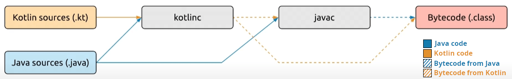
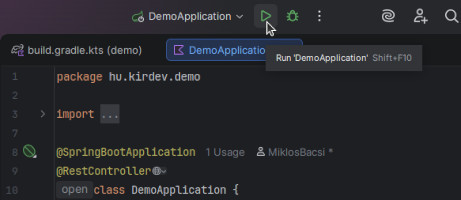
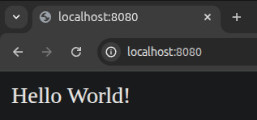
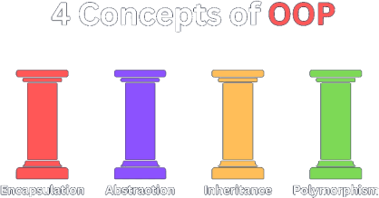
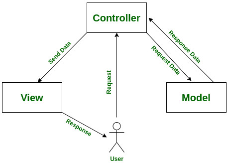
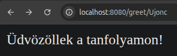
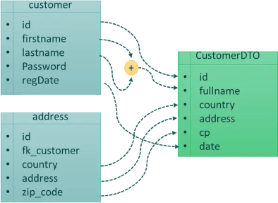
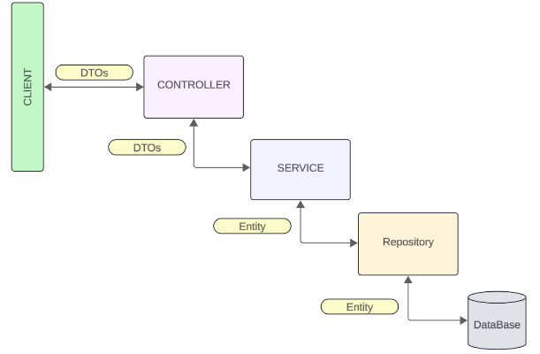
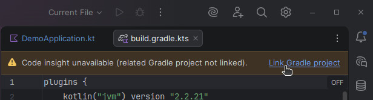

# Spring tanfolyam - 1. alkalom

---

## Miről lesz szó?

Megismerkedünk a Kotlin programozási nyelvvel, a Java futtatókörnyezettel, ami a program végrehajtását lehetővé teszi, a Gradle build eszközzel és a Spring Boot keretrendszerrel. Az objektum-orientált programozási minta áttekintése után nézünk egy demo-t is.

Fontos: a tananyagban **videó hivatkozásokat is elhelyeztünk**, amelyek emészthetőbbé és izgalmasabbá teszi a tanulást, így **megtekintésüket mindenkinek ajánljuk**.

Ha bármilyen kérdésed felmerülne, akkor [ide kattintva](https://tanfolyam.kir-dev.hu/docs/get-started/intro) megtalálod az illetékeseket, akiket tudsz keresni.

Előadás felvételeinket [visszanézheted YouTube-on:wink:](https://www.youtube.com/watch?v=LJTRZUtuP1Y&list=PLJWjD3oW-Be6ECQyG-8rmuhvmHQ54E4YB)

---

## Kotlin (és Java)

Ha már a Kotlinról beszélünk, akkor nem mehetünk el figyelem nélkül a Java mellett.

### Mi az a Java?


A Java **általános célú, objektumorientált programozási nyelv**, amelyet James Gosling kezdett el fejleszteni, később átvette a Sun Microsystems, aki fejlesztette a ’90-es évek elejétől kezdve egészen 2009-ig, amikor a céget felvásárolta az Oracle.

A Java **több mint 30 éve az egyik legelterjedtebb nyelv a világon**. A **nagyvállalati rendszerek, banki szoftverek, webes backendek nagy része máig Javával készül** – és ez így is marad még hosszú évekig.

Ugyanakkor a Java kódja sokszor hosszabb és ismétlődőbb, mint kellene. Bizonyos hibákat (például null-érték miatti összeomlást) csak futás közben vesz észre a program, amit bosszantó és időigényes lehet debugolni. Kezdők számára különösen nehéz lehet követni a sok boilerplate kódot (üres metódusok, getter/setter sorok, ellenőrzések).

### Mi az a Kotlin?


A Kotlin egy **modern, barátságos programozási nyelv**, amit a JetBrains fejlesztett 2011-től. Legfontosabb jellemzője, hogy **teljesen kompatibilis a Javával**, ugyanazon a platformon (**JVM**) fut, ugyanazokat a könyvtárakat használja – mégis **sokkal kényelmesebb, rövidebb és biztonságosabb kódot lehet vele írni, mint Javában**.

Kezdetben főleg Android-alkalmazásokhoz vált népszerűvé (a Google 2017 óta hivatalosan is ajánlja), de mára a **backend fejlesztés egyik kedvenc eszköze** lett – különösen a **Spring Boot framework-kel párosítva**.

Szóval hogyan viszonyul a Kotlin a Javához?
Kotlin – **ugyanaz a motor, de modernebb kormány és fékek.**

_**Rövid videók (YouTube: Fireship): [Kotlin](https://youtu.be/xT8oP0wy-A0?si=2D4FoSEOWCF8R4aD), [Java](https://youtu.be/m4-HM_sCvtQ?si=2TDr-9M1n6xISOjV)**._

_**[Kotlin története (YouTube)](https://youtu.be/uE-1oF9PyiY?si=_wEj-exdNQRAekq5)**_

---

## Java futtatókörnyezet

### Natív kóddal járó kellemetlenség

Eddig a tanterv szerint csak C/C++ nyelvet tanultatok, amivel natív alkalmazásokat lehet készíteni. Megírtuk a kódot .c és .cpp fájlokban, majd abból a compiler segítségével egy kitüntetett architektúrájú platformra fordítottuk le a bináris, végrehajtható programot, ami CPU már gond nélkül futtatott.

Mi történik, ha azt a végrehajtható fájlt egy másik architektúrájú számítógépen próbáljuk futtatni? A programunk sajnos nem fog futni, mert a másik architektúrára tervezett processzor nem érti az utasításokat, így minden egyen architektrúrára külön-külön le kell fordítanunk a programunkat, hogy ott futtatni tudjuk.

Vajon mi a helyzet, ha azonos architektúrára (pl. x86), de másik operációs rendszerre (pl. Windows &rarr; Linux) próbáljuk átvinni a végrehajtó programunkat. Azt gondolnánk, hogy ebben az esetben végre szerencsével járunk, de mivel az operációs rendszerek rendszerhívási mechanikája eltér, így most is szomorkodnunk kell:cry:.

Tehát nem csak eltérő architektúrák, hanem **eltérő operációs rendszerek esetén is mindig úra kell fordítanunk a kódot az adott célplatformra**, ami mind fejlesztőként, mind felhasználóként súlyosan érint minket.

### JVM (Java Virtual Machine)

A **hordozhatóságnak napjainkban egyre fontosabb szerepe van**, és az előbb felsorolt kellementlenségeknek a megszüntetésére egy **remek megoldást nyújt nekünk a Java virtuális gép**.


Alább látható a különböző rétegek, amik egymásra épülnek. A Java virtuális gép (virtuális gép ≈ **absztrakt számítógép architektúra**) az operációs rendszer felett helyezkedik el, és **futásidőben értelmezi neki írt kódot, amit rögtön bináris kóddá alakít, amelyet a CPU már végre tud hajtani** (az adott platformon!).


A Java fordítója nem bináris, végrehajtható kódra fordítja le az utasításainkat, hanem egy úgynevezett **bytecode-ra** (.class kiterjesztéssel rendelkezik). Ezt a bytecode-ot érdemes úgy elképzelni, mint a **Java virtuális gépre írt program elemi utasításai** (egyféle assembly kód), azaz ez **nem függ semmilyen hardvertől vagy operációs rendszertől**.

A JVM előnye, hogy ez teljes mértékben egy szoftver, így az összes platformon ugyan az a specifikáció alapján megvalósíthatjuk meg, így **bevezethetve egy új réteget, amire építve elértük a platformfüggetlenséget**.

Itt azért fontos megjegyezni, hogy **sok esetben mégsem lesz teljesen platformfüggetlen az alkalmazásunk vagy csak korlátozottan**, mivel vannak olyan könyvtárak, amiket nem implementálnak az összes platformon, és a hiányzó függőséget miatt nem leszünk képesek futtatni a programunkat.


A valós időben értelmezett kód lehetővé teszi a platformfüggetlenséget, de végrehajtása nyilván lassabb, mint a bináris kódoké, így **teljesítmény-kritikus rendszerekben a használata nem ajánlott**.

Ezen kívül a **Garbage Collector** (szemétgyűjtő) is **időszakosan teljesítmény-visszaeséseket okoz**. Javában **nem kell foglalkoznunk a memória-kezeléssel**, pontosabban a memória felszabadításával, mert mi mindig csak új objektumokat hozunk létre (memóriafoglalás), viszont időszakosan jön a garbage collector, aki mint egy jó kukásautó és "elviszi a szemetet", azaz **felszabadítja a** nem használt (pontosabban: **nem hivatkozott**) **objektumokat**.

_**[Hogyan működik a JVM? (YouTube)](https://youtu.be/cAoymPToQdg?si=ex5XfPWgfJg-eGoc)**_

_**[Hogyan működik a Gargabe Collector? (YouTube)](https://youtu.be/Mlbyft_MFYM?si=_oA1Bs40cX2AEubd)**_

### JRE (Java Runtime Environment) és JDK (Java Development Kit)

A JRE, azaz a **Java futtatókörnyezet** tartalmazza a Java virtuális gépet és az egyéb könyvtárakat, ami **lehetővé teszi számunkra a programok futtatását**. Ha például Minecraft-ot szeretnénk játszani, akkor elégséges, ha JRE telepítve van a számítógépünkön.

Ha azonban előállítani is szeretnénk Java alkalmazást, akkor viszont **JDK**-ra van szükségünk, ami a JRE-n kívül a **fejlesztői eszközöket is magába foglalja**.


## Kotlin fordító

A lenti ábrán látható, hogy hogyan **működik együtt** a Kotlin fordító (**kotlinc**) a Java fordítóval (**javac**), hogy elkészítsék a végleges bytecode-ot. (A Kotlin fordító **csak .kt** (kotlin) **fájlokat fordít**, .java fájlokat nem.)



---

## Build eszközök: Gradle (és Maven)

Amikor egy Spring Boot + Kotlin projektet készítünk, nem elég megírni a kódot, azt is meg kell mondani a gépnek, hogy

- milyen könyvtárakat (függőségeket) használjunk
- hogyan fordítsa le a kódot
- hogyan futtassa a teszteket
- hogyan készítsen futtatható fájlt

**Erre szolgálnak a build eszközök** (build tool-ok). A két legnépszerűbb a Maven és a **Gradle**, és mi a tanfolyamon az utóbbit fogjuk használni.

### Maven

Maven a **klasszikus, megbízható választás**, ami már 2004 óta van velünk, és sokáig ez volt a Java világ standardja. **Sok nagyvállalatnál máig ezt használják**, mert stabil és jól dokumentált.


Akkor mégis mi vele a baj?

**Konfigurációja egy** pom.xml (Project Object Model) nevű **XML fájlban történik**, és éppen ez a hátránya. Az XML fájlokat szerkeszteni és áttekinteni egy kegyetlen, embert próbáló feladat. Hátránya, hogy a fájl **gyorsan hosszúra tud nőni és ismétlődésekkel tud megtelni**, főleg bonyolultabb projekteknél.

### Gradle

A **modern, rugalmas** kedvencünk, ami 2007 óra létezik, és napjainkra **különösen népszerűvé** vált Kotlin projektekben és Spring Boot fejlesztésben.


Konfigurációja Kotlin DSL-lel történik (**build.gradle.kts** fájl) – ez azt jelenti, hogy **maga a build fájl is Kotlin kód, amit az IDE** (pl. IntelliJ:heart:) **szépen színez, autocomplete-ol és ellenőriz**. A Gradle **gyorsabb a mindennapi fejlesztésben**, mivel okos cache-eket használ, és **csak azt építi újra, ami változott** (incremental build), így gyorsítva a fordítás folyamtát. A **konfigurációja sokkal rugalmasabb, könnyebb testre szabni és átlátni**, mint a Maven-ét.

_**[Gradle használatának előnyei (YouTube)](https://youtu.be/NTnJwQbxRss?si=qbw7DcDZnVrit2YP)**_

---

## IntelliJ IDEA

Az IntelliJ IDEA (rövdien csak IntelliJ) a **JetBrains által fejlesztett egyik legjobb IDE** (integrált fejlesztői környezet), **Java és Kotlin programozáshoz**. Maga a JetBrains alkotta meg a Kotlint, így itt a legsimább az élmény.


Két verzió elérhető:

- **Community:** ingyenes

- **Ultimate:** előfizetős, de **@edu.bme.hu-s fiókkal regisztráció után**, tanulmányi célokra **ingyenesen használható**. Rengeteg hasznos funkcióval rendelkezik, köztük Spring Boot projekt létrehozása, így **mindenkinek ez az IDE használata ajánlott**!

_**[JetBrains tanulmányi csomag!](https://www.jetbrains.com/academy/student-pack/)**_

_**[IntelliJ IDEA története (YouTube)](https://youtu.be/jTZVx4TCmI4?si=plvTstOzBA9bDQmm)**_

---

## Spring Boot

A Spring Boot **egy framework** (keretrendszer), **ami a Spring** nevű óriási Java **ökoszisztéma tetejére épül**. A Spring maga már 20+ éve az **egyik legnépszerűbb eszköz enterprise Java fejlesztéshez** – de régen nagyon sok konfigurációt, XML-t és boilerplate kódot igényelt.
A Spring Boot 2014-ben indult azzal a céllal, hogy ezt az egészet drasztikusan leegyszerűsítse. A mottója: „Just run” – azaz írd meg a kódot, és máris futtatható egy önálló alkalmazás, minimális beállítással.


### Miért olyan népszerű a Spring Boot?

Képzeld el, hogy egy webes API-t, REST szolgáltatást vagy mikroszolgáltatást akarsz készíteni adatbázissal, biztonsággal, logolással. Normál Springgel ehhez órákig/hónapokig konfigurálnál dolgokat. **Spring Boot-tal:**

- **Automatikus konfiguráció:** pl. ha látja, hogy van egy adatbázis driver a classpath-en, **magától beállítja a kapcsolatot**. Ha van webes dependency, **beépít egy Tomcat szervert**.
- **Beépített szerverek** (Tomcat, Jetty, Undertow): **nem kell külön app szervert telepíteni**, csak elindítjuk és már fut is a 8080-as porton.
- **Spring Initializr** ([start.spring.io](https://start.spring.io/)): pár kattintással **generál neked egy kész projektet** Gradle/Maven + Kotlin/Java + kívánt függőségekkel (Web, JPA, Security stb.)
- **Production-ready feature-ök out-of-the-box:** health check endpoint (/actuator/health), metrikák (/actuator/metrics), logolás, külső konfiguráció (application.yml /properties), graceful shutdown stb.
- **Kiváló Kotlin támogatás:** a 4.0+ verziókban **Kotlin-first feature-ök érkeznek**, pl. jobb co-routine integráció, null-safety kihasználása a Spring komponensekben.

### Spring vs Spring Boot röviden és szemléletesen

**Spring** = egy **hatalmas doboz LEGO kocka**

**Spring Boot** = ugyan az a doboz, de **előre összerakott darabok:** házak, autók, hidak, **és egy varázspálca**, ami a **hiányzó darabokat magától odateszi**, ha látja, hogy szükséged van rá.

_**Mi az a Spring Boot és miért jó? (YouTube): [CodeHead](https://youtu.be/-ILh8pl5lj8?si=sUWMl746mfezY7_4), [Mosh](https://youtu.be/v73-ps01c5w?si=EcJ66S3f6maaDH5P)**._

---

## Demo app

Nézzük meg, hogy milyen egyszerűen el lehet készíteni egy backendet Spring Bootban!

Először is **hozzunk létre egy új projektet** IntelliJben:


Ezután **vegyük fel a szükséges függőségeket** (könyvtárakat) a `build.gradle.kts` fájlban:

```gradle
dependencies {
    implementation("org.springframework.boot:spring-boot-starter-data-jpa")
    implementation("org.springframework.boot:spring-boot-starter-web")
    implementation("com.fasterxml.jackson.module:jackson-module-kotlin")
    implementation("org.jetbrains.kotlin:kotlin-reflect")
    runtimeOnly("com.h2database:h2")
    testImplementation("org.springframework.boot:spring-boot-starter-test")
    testImplementation("org.jetbrains.kotlin:kotlin-test-junit5")
    testRuntimeOnly("org.junit.platform:junit-platform-launcher")
}
```

A függőségeket `GroupID`**:**`ArtifactID`**:**`Version` formátumban kell megadni Gradleben (a verziószámot lehagyhatjuk), ahol a `GroupID` az általában a fejlesztő szervezet vagy a projekt fordított domain neve, míg az `ArtifactID` magát a konkrét könyvtárat vagy modult.

**Fontos:** Hogy **újratöltsük a projektet**, kattintsunk rá a jobb felső sarokban megjelenő elefántra:elephant: Ha ezt nem tesszük meg, akkor nem fognak frissülni az imént hozzáadott függőségek, és furcsa dolgok történhetnek az IDE-ben.


Fogjunk is hozzá az első Spring Boot backend megírásához! **Készítsünk egy webszervert, ami a "/" endpointon** (ami jelen esetben a `http://localhost:8080/` URL-en elérhető) **visszaad egy sztringet:** `Hello World!`.

**Vegyünk fel egy osztályt DemoApplication néven**, amit felruházunk két annotációval (az @Annotáció a forráskód extra információval/funkcionalitással való kibővítése). A `@SpringBootApplication` jelöli, hogy ez az osztály valósítja meg a Spring Boot alkalmazásunkat, míg a `@RestController` azt írja le, hogy az osztályunk egyben egy kontroller is lesz, ami a végpontokat kezeli.

Az osztályon belül **hozzunk létre egy GET típusú végpontot** a `@GetMapping` annotáció `greet()` (köszönt) függvényre való helyezésével, ami **visszatér egy** `"Hello World!"` **sztringgel**.

```kotlin
package hu.kirdev.demo

import org.springframework.boot.autoconfigure.SpringBootApplication
import org.springframework.boot.runApplication
import org.springframework.web.bind.annotation.GetMapping
import org.springframework.web.bind.annotation.RestController

@SpringBootApplication
@RestController
class DemoApplication {
    @GetMapping(path = ["/"])
    fun greet() : String {
        return "Hello World!"
    }
}

fun main(args: Array<String>) {
    runApplication<DemoApplication>(*args)
}
```

Azt figyeljük meg, hogy **itt nem kellett példányosítani és argumentumként átadni**, hanem a `main` függvényen belül egy `runApplication` hívást végzünk, aminek csak átadjuk, hogy egy DemoApplication típusú alkalmazást szeretnénk futtatni, és **a dependency injection** (a Spring Boot-os "varázspálcával") **kitölti helyettünk**.



Ha **futtatjuk a programot**, akkor elindul egy webszerver a 8080-as porton, és a `http://localhost:8080/` URL-t meglátogatva láthatjuk a `Hello World!` szövegünket.



---

## OOP

**C-s világban a változóink és a függvényeink össze-vissza helyezkednek el**, így egy nagyobb projeknél szinte biztos, hogy **spagetti kódba** futunk (amikor annyira bonyolult a működés, hogy nem lehet kibogózni mi mit csinál, és teljesen karbantarthatatlan a forráskód).

Ennek a problémának az orvosolására lett kitalálva az **OOP** (Objektum Orientált Programozás), ami a **logikailag összetartozó változókat és függvényeket összecsomagolja egy osztályba**, továbbá megkönnyíti komplex problémák modellezését, csökkenti a kódduplikálást, és rugalmasabbá teszi a fejlesztést.

Az **osztály egy sablon/tervrajz**, és az **objektum** az pedig **maga a példányosított dolog**. Egy osztály alapján (általában) több objektumot is lehet példányosítani. **Ha az osztály egy autó tervrajza, akkor a gyártósorról leguruló járművek az objektumok**.

### Az OOP négy alappillére



#### Egységbezárás (Encapsulation)

A logikailag összetartozó változók és függvények összecsomagolásán kívül az **objektum belső állapotának védelmét is jelenti**, mivel **csak publikus metódusokon** (tagfüggvényeken) **keresztül érhetők el az adatok**.

#### Öröklés (Inheritance)

Ha egy osztályból leszármazunk, akkor a leszármazott osztály az **ősosztály tulajdonságait** (jelen esetben tagváltozóit és tagfüggvényeit) **örökli**, így **megúszhatunk nagyon sok kódduplikációt**, és **rugalmasabbá tehetjük a későbbi fejlesztést**.

Tegyük fel, hogy egy forgalmi rendszert modellezünk különböző járművekkel és a **Jármű (absztrakt) ősosztályban megvalósítunk rengeteg dolgot** például a navigációt, így egy **új járművel való bővítés esetén** (pl. motor vagy busz) **nem kell** újra és újra **leírni a felesleges boilerplate kódot**.

**Gondoljuk bele abba, hogy hány helyen kéne módosítani a forráskódot**, ha mostantól máshogyan kanyarodnánk jobbra (pl. más protokoll szerint) ... jó esetben csak egy helyen, a Jármű osztályban.

**Fontos: Javás világban csak egy osztályból származhatunk le, azaz nincs többszörös öröklés!**

#### Sokalakúság (Polymorphism)

Egy objektum (típusától függően) **máshogyan viselkedhet**.

Vegyünk egy **alakzat ősosztályt**, amiből különböző alakzatok származnak le pl. kör, négyzet és háromszög. Ha a kódunkban van egy olyan rész, ami az **alakzat kirajzolásáért** felel, akkor elég **`alakzat.rajzol();`** parancsot írni, és a **mögötte lévő osztály az lekezeli saját maga kirajzolását**, és nem kell külön, feleslegesen rajzolKör(), rajzolNégyzet(), rajzolHáromszög() függvényeket írni, majd egy switch case-ben kiválsztani a megfelelőt minden egyes alkalommal.

#### Absztrakció (Abstraction)

A **külvilág felé jelentéktelen függvények és változók elrejtése**, és **csak a lényeges részek mutatása**.

_**[OOP 4 alappillére (YouTube)](https://youtu.be/pTB0EiLXUC8?si=MpStxDDM_TuAi2Ov)**_

## Interfészek

### Mi az az interfész?

Az interfész **olyan, mint egy szerződés: megmondja, hogy egy osztálynak milyen metódusokat** (tagfüggvényeket) **kell mindenképpen tudnia**.

Ha egy osztály vállalja, hogy megvalósít egy interfészt, akkor az **interfésznek minden metódusával köteles rendelkeznie**, ami azt jelenti, hogy bármely ilyen osztálynak meghívható az interfész akármelyik metódusa.

### Mire jók az interfészek?

A **jól definiált interfészek elengedhetetlenek** nagy projektek esetén, mert **ezek mentén modulokra bonthatjuk a rendszerünket**, amiket külön-külön párhuzamosan is fejleszthetünk, ráadásul **egy komponens cseréje esetén nem kell mindent újraírni**, hanem csak az interfész vonaláig. Mondhatnám szépen nézne ki, ha egy adatbáziskezelő szoftvert újra kéne írni, ha az alatta lévő fizikai tártolót merevlemezről SSD-re cserélnénk.

Nézzünk az interfészekre még egy szemléletes példát!

**Vegyük a HDMI-t**, mint egy olyan interfészt, ami **videó** (és audió) **megjelenítésére alkalmas portot definiál**. Ezt az interfész pl. egy TV, monitor vagy projektor **valósítaná meg**, míg egy PC, laptop vagy konzol **tudná használni**.

Rendkívül fontos itt megemlíteni, hogy itt egy projektort egyáltalán nem érdekli, hogy az interfész másik végén mi található (pl. MacBook vagy Xbox konzol), neki a feladata a kép megjelenítése, amihez az információt jól meghatározott úton kapja. Ez fordítva is elmondható: egy számítógép csak kiküldi magából a videót, és a monitor majd valahogyan megjeleníti.

Technológiailag a számítógépek videókártyája eltér, és egy projektor is teljesen máshogyan jelenít meg képet, mint egy OLED TV, mégis bármilyen videót kiadó eszköz tud kommunikálni bármilyen képet lejátszani képes eszközzel, amennyiben mind a ketten támogatják a HDMI interfészt, és **nem kell az N-féle forrás eszköz és M-féle lejátszó eszköz között N\*M különböző verziót implementálni**!

**Javás világban csak egyetlen osztályból lehet leszármazni, így a maradékot interfészek megvalósításával kell megoldani!!!**

_**[Interfészek (YouTube)](https://www.youtube.com/watch?v=c2sTQk9opO8)**_

---

## MVC

Az MVC (**Model-View-Controller**) egy **népszerű tervezési minta** (design pattern), amit főleg webes alkalmazásoknál használnak, ami három fő részre bontja a programot:

- **Model:** az adatok és az üzleti logika (adatbázis, számítások, szabályok)
- **View:** a megjelenítés (HTML, képernyő, amit a felhasználó lát)
- **Controller:** a „közvetítő”, ami fogadja a felhasználó kérését, kezeli a Model-t, és eldönti, melyik View-t küldje vissza



Az MVC jelentősége abban rejlik, hogy **tisztán szétválasztja a felelősségeket**, így a kód olvashatóbb, könnyebben bővíthető, tesztelhető és karbantartható lesz. **Például ha megváltoztatod a dizájnt (View), akkor nem kell piszkálnod az adatokat** (Model), és fordítva – ez különösen nagy projekteknél spórol rengeteg időt és hibát. **Spring Boot-ban** (és sok más modern frameworkben) **ez a minta az alapja a webes alkalmazások felépítésének**.

_**[MVC a webfejlesztésben (YouTube)](https://youtu.be/DUg2SWWK18I?si=mnspEoQvxQOl7GqT)**_

## MVC a Spring Bootban

A **Spring MVC** keretrendszer kezeli a webes kéréseket a klasszikus Model-View-Controller minta szerint:

- **Controller:** **Vezérlésért felelős**, azaz fogadja a HTTP kérést (pl. @GetMapping, @PostMapping), feldolgozza a bemenetet, meghívja a megfelelő Service-t, majd visszaadja a választ (általában egy View nevét vagy JSON-t).
- **Service**: Az **üzleti logika rétege**. Itt történik a számítás, szabályellenőrzés, más komponensek hívása. Nem tud az adatbázisról vagy a HTTP-ről – csak a logikáról.
- **Repository:** Az **adatbázis réteg** (Spring Data JPA-val általában @Repository interfész). Itt történik az adat olvasása/írása (findById, save, delete stb.). Automatikusan implementálja a Spring.
- **Model:** Az **adatok hordozója**. Lehet egy sima objektum (pl. **@Entity osztály**), DTO, vagy akár Map is. A Controller/Service ebből adja át az adatokat a View-nak (vagy JSON-ként a REST válaszba).

Tipikus rétegek sorrendje Spring Boot-ban:
HTTP kérés → Controller → Service → Repository → Adatbázis
(visszafelé: Adatbázis → Repository → Service → Controller → HTTP válasz / View)

**Röviden: a Controller irányít, a Service gondolkodik, a Repository olvassa/írja az adatokat, a Model pedig az, amit ezek között mozgatunk.**

_**[MVC a Springben + Annotációk (YouTube)](https://youtu.be/zGSX5AqfKvU?si=Iilg_vO2PDqb9eYd)**_

---

## Kotlin alapok

Ez egy nagyon rövid bemutató lesz, ami csak a következő kódrészletek megértéséhez szükséges.

### Függvények és változók

A hello world így néz ki Kotlinban:

```kotlin
fun main() {
    println("Hello World!")
}
```

Azt rögtön észrevehetjük, hogy **nem kell kirakni `;`-ket az utasítások végére**, továbbá a `fun` kulcsszó a function rövidítése. **Ha egy függvény nem tér vissza semmivel, akkor azt nem kell kiírni** viszont, ha mégis visszatér valamivel, akkor ki kell írni a függvény feje és egy `:` között, például:

```kotlin
fun add(a: Int, b: Int): Int {
    return a + b
}
```

Azt is megfigyelhetjük, hogy a **változók típusát is `név: Típus` alakban adjuk meg**, ami elsőre sátánidézésnek tűnhet, de nem sok idő után egész kényelmessé válik főleg, ha a változó nevét részesítjük előnyben és nem a típusát.

### val vs var

`val`: value, **nem módosítható**
`var`: variable, **módosítható**

```kotlin
val pi = 3.14 // final / const / readonly — nem lehet módosítani
var counter = 0 // normál változó, lehet módosítani
```

Most legyünk teljesen őszinték: a `const` kulcsszót lusták vagyunk kiírni, de ha `var`-t írunk, akkor annyival már írhatnánk `val`-t is, és lehet nem is akartuk módosítani az értéket, sőt rengeteg bug-ot ki lehet vele szűrni.

### Tagváltozók és tagfüggvények

A tagváltozókat és a tagfüggvényeket (metódusokat) **`objektum.tagVáltozó`** illetve **`objektum.tagFüggvény()`** szintaxissal érjük el.

### Null és null safety

A `null` kotlinban azt jelzi, hogy az érték **nem rendelkezik érvényes értékkel**.

Ha van egy változónk, ami Int típusú, akkor az biztosan csak valid értékkel rendelkezik, de **ha a típus mögé odaírunk egy `?`-t** (például `Int?`), **akkor tartalmazhat érvénytelen értéket is!**

A **fordító kikényszeríti, hogy minden esetben kezeljük le** az ilyen típussal rendelkező objektumainkat, de cserébe nem kapunk segmentation fault-ot, mint C-ben, sőt ha egyszer lekezeljük (pl. egy érték beolvasásánál), akkor nem kell tovább hurcolnunk magunkat a `null` vizsgálatot.

```kotlin
var name: String = "Peti"     // nem lehet null → biztonságos
var nickname: String? = null  // ? jelzi, hogy null is lehet

println(name.length)          // OK, compiler tudja, hogy nem null

// println(nickname.length)   // ← FORDÍTÁSI HIBA!

if (nickname != null) {
    println(nickname.length)  // OK – smart cast
}
```

Ha `?.` operátor **bal oldalán null érték szerepel**, akkor **`null`-t ad vissza**, de **érvényes érték esetén sima `.`-ként viselkedik**.

Ha a `?:` operátor **bal oldalán** egy **érvényes érték szerepel**, akkor **visszaadja azt**, de **`null` esetén a jobb oldalt fogja visszaadni**.

```kotin
// vagy röviden (safe call):
println(nickname?.length)     // null → null lesz az eredmény

// vagy ha tutira nem null, de muszáj:
println(nickname!!.length)    // NullPointerException ha mégis null

fun findPerson(id: Int): Person? = ...   // lehet null
val person = findPerson(42) ?: throw NoSuchElementException("Nincs ilyen személy")
```

### Listák

```kotlin
val numbers = listOf(1, 3, 5, 7)          // immutable
val mutable = mutableListOf(2, 4, 6)

numbers[1]                                // 3
mutable.add(8)

val doubled = numbers.map { it * 2 }      // [2,6,10,14]
```

A legutolsó sorban a `map` metódus fogja minden elemet (az egyes elemeket az `it` jelöli), és megszorozza 2-vel.

---

## Demo bővítése Service-szel

### Service hozzáadása

**Hozzunk létre egy új fájlt** `UjoncGreetingService.kt`, és készítsünk el benne egy **köszöntő szolgáltatás**t (GreetingService)!

Először is készítsünk egy `GreetingService` **interfészt**, ami egyetlen `greetPerson` **függvénnyel rendelkezik**. Ez a metódus **paraméterként átvesz** egy sztringet, ami a **személy nevét** tartalmazza, és egy **köszöntéssel tér vissza** (ami szintén egy sztring).

Készítsünk egy ilyen szolgáltatást, ami ezt az interfészt valósítsa meg `UjoncGreetingService`. Ha az `ujonc` nevet adjuk meg, akkor `Üdvözöllek a tanfolyamon!`-nal köszönjön vissza, egyébként `Szia <név>!`-vel.

```kotlin
package hu.kirdev.demo

import org.springframework.stereotype.Service

interface GreetingService {
    fun greetPerson(name: String): String
}

@Service
class UjoncGreetingService : GreetingService {
    override fun greetPerson(name: String): String {
        if (name.lowercase() == "ujonc")
            return "Üdvözöllek a tanfolyamon!"
        else
            return "Szia $name!"
    }
}
```

Az interfész megvalósítását az osztály neve után írt `: GreetingService`-szel tudjuk jelölni, és a `greetPerson` metódust felül kell írnunk, amit az `override` kulcsszóval tehetünk meg.

### Controller átvitele egy külön fájlba

Hogy gyakoroljuk az MVC szeparációt **vigyük át a kontrollert is egy másik fájlba**! Ekkor a **`DemoApplication`-ünk üresen fog maradni**, de `@SpringBootApplication` annotáció miatt továbbra is remekül fog működni. Mégis hogy van ez, olyan furcsán néz ki? Itt is ismét a dependency injection (a Spring Boot-os "varázspálca") kitölti ki nekünk, ami hiányzik.

```kotlin
package hu.kirdev.demo

import org.springframework.boot.autoconfigure.SpringBootApplication
import org.springframework.boot.runApplication

@SpringBootApplication
class DemoApplication {
}

fun main(args: Array<String>) {
    runApplication<DemoApplication>(*args)
}
```

### Módosítás a kontrolleren

Hogy az újonnan létrehozott szolgáltatásunkat használni tudjuk módosítanunk kell a kontrolleren, de gyakorlás képpen egy extra dolgot ki fogunk próbálni, névlegesen: a `/` végpont helyett használjuk a `/greet`-et, amit a `@RequestMapping` annotáció osztályra való biggyesztésével tudunk elérni (ami egy végpont paramétert fogad).

Ne haladjunk ennyire előre, először **hozzuk létre az új fájlt** `MainController.kt` néven. Az osztályunk paraméterül fogad egy `GreetingService`-t, hogy kezelni tudja.

A `greet` metóduson annyit kell változtatni, hogy a rá helyett annotációt `@GetMapping("/{name}")`-re változtatjuk és a `name` paraméterünk elé `@PathVariable`-t írunk. Ezzel azt érjük és, hogy az **URL-ben megadhatjuk a nevet, mint változót**! Például a `/greet/Ujonc` esetén `name = "Ujonc"`.

```kotlin
package hu.kirdev.demo

import org.springframework.web.bind.annotation.GetMapping
import org.springframework.web.bind.annotation.PathVariable
import org.springframework.web.bind.annotation.RequestMapping
import org.springframework.web.bind.annotation.RestController

@RestController
@RequestMapping("/greet")
class MainController(val greetingService: GreetingService) {

    @GetMapping("/{name}")
    fun greet(@PathVariable name: String) : String {
        return greetingService.greetPerson(name)
    }
}
```

Teszteljük le, hogy tényleg jól működik-e a programunk! Miután elindítottuk az alkalmazást, **nyissuk meg a böngészőben** a `http://localhost:8080/greet/Ujonc` URL-t! Ha mindent jól csináltunk, akkor az alábbi üzenet fogad minket:



**Próbáljuk ki egy másik névvel is!** Mit tapasztalunk?


---

## Adatbázis: JPA és H2

### Spring Data JPA


A Spring Data JPA **egy Spring Boot kiegészítő**, ami **drasztikusan leegyszerűsíti az adatbázis-műveleteket**. Nem kell kézzel SQL-t írnunk vagy bonyolult DAO (Data Access Object) osztályokat készítenünk – **elég egy interfészt definiálnunk**, ami kiterjeszti a JpaRepository-t, és a Spring **automatikusan implementálja nekünk a gyakori műveleteket!**

```kotlin
interface UserRepository : JpaRepository<User, Long> {
    fun findByEmail(email: String): User?
    fun findAllByActiveTrue(): List<User>
}
```

### H2

Az H2 **egy könnyű, beágyazható** (embedded) **adatbázis**, amit **fejlesztés közben** és tesztelésnél **nagyon gyakran használnak** Spring Boot projektekben. Teljes mértékben a memóriában fut, és van egy webes konzolja, ahol böngészőben nézhetjük az adatokat.

## Demo bővítése adatbázissal

### H2 konfiguráció

Ezt **adjuk hozzá** az `application.properties` nevű fájlhoz, ami az `src/main/resources/` mappában található.

```kotlin
# H2 Database
spring.h2.console.enabled=true
spring.datasource.url=jdbc:h2:mem:dcbapp
spring.datasource.driver-class-name=org.h2.Driver
spring.datasource.username=sa
spring.datasource.password=password
spring.jpa.database-platform=org.hibernate.dialect.H2Dialect
spring.jpa.show-sql=true
```

### Modell felvétele

**Vegyünk fel egy adatok tárolására szolgáló osztályt** (`GreetingEntity`), aminek segítségével **azokat neveket fogjuk elmenteni, akiknek köszöntek** (illetve egy azonosítót is rendelünk a köszönésekhez).

```kotlin
package hu.kirdev.demo

import jakarta.persistence.*

@Entity
@Table(name = "greetings")
data class GreetingEntity (

    @Id
    @GeneratedValue(strategy = GenerationType.SEQUENCE)
    var id: Int? = null,

    var name: String = ""
)
```

Egy `data class`-t használtunk (kerek zárójelek kellenek és nem kapcsosak!), ami adatok tárolására használatos, és nekünk azért jön most kapóra, mert automatikusan legenerálja nekünk a fordító a boilerplate getter/setter függvényeket.

A `@Entity` jelöli, hogy ez egy Model lesz az MVC-ből, és ez **szükséges az alkalmazásunk megfelelő működéséhez**!

A `@Table(name = "greetings")` annotációval azt tudjuk megmondani, hogy az adatbázisban a tábla neve `greetings` legyen.

Az `id` azonosító változóra helyeztünk két annotációt. A `@Id` biztosítja, hogy az objektumok tényleg **egyértelműen azonosíthatók legyenek**. A `@GeneratedValue` azt jelenti, hogy egy ilyen objektum létrehozásakor **nem kell megadni az értékét**, hanem azt **automatikusan fogja kitölteni** - jelen esetben 1-től indul és mindig 1-el növekszik.

### Adatbázisréteg (Repository) felvétele

**Hozzunk létre egy új interfészt** `GreetingRepository` néven, ami **kibővíti a JpaRepository interfészt**! **Vegyünk fel egy metódust**, ami egy nevet kap, és **visszaadja, hogy hány köszönés történt ezzel a névvel** (kis- és nagybetűt nem megkülönböztetve).

```kotlin
package hu.kirdev.demo

import org.springframework.data.jpa.repository.JpaRepository
import org.springframework.stereotype.Repository

@Repository
interface GreetingRepository : JpaRepository<GreetingEntity, Int> {
    fun countByNameIgnoreCase(name: String): Long
}
```

Vegyük észre, hogy az **SQL lekérdezést nem kellett kézzel megírnunk**, hanem **automatikusan implementálódik a metódus neve alapján**! (Persze ez csak bizonyos, gyakori lekérdezésekkel működik - ha odaírjuk, hogy `fun getMeaningOfLife() : String`, akkor nem fogja tudni megoldani azt, amit szeretnénk :cry:)

### Service módosítása

Először a `GreetingService`-t bővítsük egy `getGreetingCount` metódussal, majd az `UjoncGreetingService` paraméterül fogadjon egy `GreetingRepository`-t, illetve legyen egy `getGreetingCount` metódusa. Ne felejtsük el lementeni a köszönéseket a `greetPerson` metódus elején!

```kotlin
package hu.kirdev.demo

import org.springframework.stereotype.Service

interface GreetingService {
    fun greetPerson(name: String): String
    fun getGreetingCount(name: String): Long
}

@Service
class UjoncGreetingService(val greetingRepository: GreetingRepository) : GreetingService {

    override fun greetPerson(name: String): String {
        greetingRepository.save(GreetingEntity(name = name))

        if (name.lowercase() == "ujonc")
            return "Üdvözöllek a tanfolyamon!"
        else
            return "Szia $name!"
    }

    override fun getGreetingCount(name: String) : Long {
        return greetingRepository.countByNameIgnoreCase(name)
    }
}
```

### Controller módosítása

Mivel lényegében egy API-n (Application Programming Interface) keresztül kommunikálunk, így `/api`**-ra cserélhetjük a korábbi** `/`-t - ezzel is jelezve a szándékunkat (most már **minden végpont a** `/api` **után jöhet csak**). Ennek következtében módosítanunk kell a `greet` metódusnál az utat `"/greet/{name}"`-ra.

**Hozzunk létre egy új végpontot** `/greetings`-en, amit meglátogatva megmondjuk, hogy az **URL-ben megadott név hányszor szerepel az adatbázisunkban**.

```kotlin
package hu.kirdev.demo

import org.springframework.web.bind.annotation.GetMapping
import org.springframework.web.bind.annotation.PathVariable
import org.springframework.web.bind.annotation.RequestMapping
import org.springframework.web.bind.annotation.RequestParam
import org.springframework.web.bind.annotation.RestController

@RestController
@RequestMapping("/api")
class MainController(val greetingService: GreetingService) {

    @GetMapping("/greet/{name}")
    fun greet(@PathVariable name: String) : String {
        return greetingService.greetPerson(name)
    }

    @GetMapping("/greetings")
    fun getGreetCount(@RequestParam name: String): String {
        return "$name ${greetingService.getGreetingCount(name)} alkalommal lett köszöntve"
    }
}
```

Figyeljük meg, hogy most `@RequestParam`-ot használtunk, így `/api/greeting?name=név` formában tudjuk megadni a nevet!

Példák a végpontokra:

- [/api/greet/Ujonc](http://localhost:8080/api/greet/Ujonc)
- [/api/greetings?name=Ujonc](http://localhost:8080/api/greetings?name=Ujonc)
- [/api/greet/Miki](http://localhost:8080/api/greet/Miki)
- [/api/greetings?name=Miki](http://localhost:8080/api/greetings?name=Miki)

---

## DTO

A DTO (Data Transfer Object) egy **egyszerű objektum**, amit arra használunk, hogy **csak a szükséges adatokat gyűjtsük benne össze, és küldjük el a kliens** (pl. böngésző, mobil app) **és a szerver között** – általában JSON formátumban. Így nem az adatbázis-entitást (Entity-t) küldjük ki közvetlenül.





---

## IntelliJ & JDK download

A második és harmadik alkalomra **live coding**-ot tervezünk, így **kérünk mindenkit, hogy töltse le az IntelliJ IDEA**-t a laptopjára, lehetőleg az **Ultimate** verziót, amihez a JetBrains student pack-et _**[ezen a linket lehet igényelni](https://www.jetbrains.com/academy/student-pack/)**_ (`@edu.bme.hu`-s email).

Hogyha valakinek nincsen letöltve a **JDK 25** (Java fejlesztői csomag), akkor azt _**[ide kattintva](https://www.oracle.com/java/technologies/downloads/#jdk25-windows)**_ megteheti.

**Hogy biztosak legyünk abban, hogy jól setup-oltuk a fejlesztői környezetet, klónozzuk le** a _**[demo projektet](https://github.com/MiklosBacsi/demo.git)**_, és **próbáljuk meg futtatni**! Ráadásul ez egy remek lehetőség a fejlesztői környezettel való ismerkedésre, így nem a live coding alkalmával fogtok először találkozni

Amennyiben szükséges _**[ide kattintva](https://tanfolyam.kir-dev.hu/docs/webes-alapok/git#alapvet%C5%91-parancsok-workflow-bemutat%C3%A1sa-demo-seg%C3%ADts%C3%A9g%C3%A9vel)**_ felfrissítheted a git tudásodat.

Amennyiben valamilyen okból a Gradle nem lenne linkelve, akkor ezt a "Link Gradle Projekt" feliratra való kattintással tegyük meg.



Indítsuk el az alkalmazást, és **próbáljuk ki, hogy működik-e**!

Példák a végpontokra:

- [/api/greet/Ujonc](http://localhost:8080/api/greet/Ujonc)
- [/api/greetings?name=Ujonc](http://localhost:8080/api/greetings?name=Ujonc)
- [/api/greet/Miki](http://localhost:8080/api/greet/Miki)
- [/api/greetings?name=Miki](http://localhost:8080/api/greetings?name=Miki)

---

Készítette: **[Bácsi Miklós](https://github.com/MiklosBacsi)**
