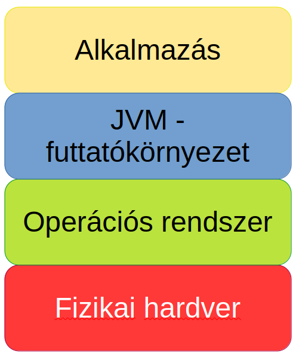

# Spring tanfolyam - 1. alkalom

---

## Kotlin (és Java)

### Mi az a Kotlin?

A Kotlin egy **modern, barátságos programozási nyelv**, amit a JetBrains fejlesztett 2011-től. Legfontosabb jellemzője, hogy **teljesen kompatibilis a Javával**, ugyanazon a platformon (**JVM**) fut, ugyanazokat a könyvtárakat használja – mégis **sokkal kényelmesebb, rövidebb és biztonságosabb kódot lehet vele írni, mint Javában**.

Kezdetben főleg Android-alkalmazásokhoz vált népszerűvé (a Google 2017 óta hivatalosan is ajánlja), de mára a **backend fejlesztés egyik kedvenc eszköze** lett – különösen a **Spring Boot framework-kel párosítva**.

### Mi az a Java?

Ha már a Kotlinról beszélünk, akkor nem mehetünk el figyelem nélkül a Java mellett.

A Java **általános célú, objektumorientált programozási nyelv**, amelyet James Gosling kezdett el fejleszteni, később átvette a Sun Microsystems fejlesztett a ’90-es évek elejétől kezdve egészen 2009-ig, amikor a céget felvásárolta az Oracle.

A Java **több mint 30 éve az egyik legelterjedtebb nyelv a világon**. A **nagyvállalati rendszerek, banki szoftverek, webes backendek nagy része máig Javával készül** – és ez így is marad még hosszú évekig.

Ugyanakkor a Java kódja sokszor hosszabb és ismétlődőbb, mint kellene. Bizonyos hibákat (például null-érték miatti összeomlást) csak futás közben vesz észre a program, ami bosszantó és időigényes lehet debugolni. Kezdők számára különösen nehéz lehet követni a sok boilerplate kódot (üres metódusok, getter/setter sorok, ellenőrzések).

Szóval hogyan viszonyul a Kotlin a Javához?
Kotlin – **ugyanaz a motor, de modernebb kormány és fékek.**

_**Rövid videók (YouTube: Fireship): [Kotlin](https://youtu.be/xT8oP0wy-A0?si=2D4FoSEOWCF8R4aD), [Java](https://youtu.be/m4-HM_sCvtQ?si=2TDr-9M1n6xISOjV)**._

_**[Kotlin története (YouTube)](https://youtu.be/uE-1oF9PyiY?si=_wEj-exdNQRAekq5)**_

---

## Java futtatókörnyezet

### Natív kóddal járó kellemetlenség

Eddig a tanterv szerint csak C/C++ nyelvet tanultatok, amivel natív alkalmazásokat lehet készíteni. Megírtuk a kódot .c és .cpp fájlokban, majd abból a compiler segítségével egy kitüntetett architektúrájú platformra fordítottuk le a bináris, végrehajtható programot, ami CPU már gond nélkül futtatott.

Mi történik, ha azt a végrehajtható fájlt egy másik architektúrájú számítógépen próbáljuk futtatni? A programunk sajnos nem fog futni, mert a másik architektúrára tervezett processzor nem érti az utasításokat, így minden egyen architekrúrára külön-külön le kell fordítanunk a programunkat, hogy ott futtatni tudjuk.

Vajon mi a helyzet, ha azonos architektúrára (pl. x86), de másik operációs rendszerre (pl. Windows &rarr; Linux) próbáljuk átvinni a végrehajtó programunkat. Azt gondolnánk, hogy ebben az esetben végre szerencsével járunk, de mivel az operációs rendszerek rendszerhívási mechanikája eltér, így most is szomorkodnunk kell:cry:.

Tehát nem csak eltérő architektúrák, hanem **eltérő operációs rendszerek esetén is mindig úra kell fordítanunk a kódot az adott célplatformra**, ami mind fejlesztőként, mind felhasználóként súlyosan érint minket.

### JVM (Java Virtual Machine)

A **hordozhetóságnak napjainkban egyre fontosabb szerepe van**, és az előbb felsorolt kellementlenségeknek a megszüntetésére egy **remek megoldást nyújt nekünk a Java virtuális gép**.

Alább látható a különböző rétegek, amik egymásra épülnek. A Java virtuális gép (viruális gép ≈ **absztrakt számítógép architektúra**) az operációs rendszer felett helyezkedik el, és **futásidőben értelmezi neki írt kódot, amit rögtön bináris kóddá alakít, amelyet a CPU már végre tud hajtani** (az adott platformon!).

A Java fordítója nem bináris, végrehajtható kódra fordítja le az utasításainkat, hanem egy úgynevezett **bytecode-ra** (.class kiterjesztéssel rendelkezik). Ezt a bytecode-ot érdemes úgy elképzelni, mint a **Java virtuális gépre írt program elemi utasításai** (egyféle assembly kód), azaz ez **nem függ semmilyen harvertől vagy operációs rendszertől**.

A JVM előnye, hogy ez teljes mértékben egy szoftver, így az összes platformon ugyan az a specifikáció alapján megvalósíthatjuk meg, így **bevezethetve egy új réteget, amire építve elértük a platformfüggetlenséget**.

Itt azért fontos megjegyezni, hogy **sok esetben mégsem lesz teljesen platformfüggetlen az alkalmazásunk vagy csak korlátozottan**, mivel vannak olyan könyvtárak, amiket nem implementálnak az összes platformon, és a hiányzó függőséget miatt nem leszünk képesek futtatni a programunkat.

A valós időben értelmezett kód lehetővé teszi a platformfüggetlenséget, de végrehajtása nyilván lassabb, mint a bináris kódoké, így **teljesítmény-kritikus rendszerekben a használata nem ajánlott**.

Ezen kívül a **Garbage Collector** (szemétgyűjtő) is **időszakosan teljesítmény-visszaeséseket okoz**. Javában **nem kell foglalkoznunk a memória-kezeléssel**, pontosabban a memória felszabadításával, mert mi mindig csak új objektumokat hozunk létre (memóriafoglalás), viszont időszakosan jön a garbage collector, mint egy jó kukásautó és "elviszi a szemetet", azaz **felszabadítja a** nem használt (pontosabban: **nem hivatkozott**) **objektumokat**.

TODO

_**[Hogyan működik a JVM? (YouTube)](https://youtu.be/cAoymPToQdg?si=ex5XfPWgfJg-eGoc)**_

_**[Hogyan működik a Gargabe Collector? (YouTube)](https://youtu.be/Mlbyft_MFYM?si=_oA1Bs40cX2AEubd)**_

### JRE (Java Runtime Environment) és JDK (Java Development Kit)

A JRE, azaz a **Java futtatókörnyezet** tartalmazza a Java virtuális gépet és az egyéb könyvtárakat, ami **lehetővé teszi számunkra a programok futtatását**. Ha például Minecraft-ot szeretnénk játszani, akkor elégséges, ha JRE telepítve van a számítógépünkön.

Ha azonban előállítani is szeretnénk Java alkalmazást, akkor viszont **JDK**-ra van szükségünk, ami a JRE-n kívül a **fejlesztői eszközöket is magába foglalja**.

## Kotlin fordító

A lenti ábrán látható, hogy hogyan **működik együtt** a Kotlin fordító (**kotlinc**) a Java fordítóval (**javac**), hogy elkészítség a végleges bytecode-ot. (A Kotlin fordító **csak .kt** (kotlin) **fájlokat fordít**, .java fájlokat nem.)

---

## Gradle (és Maven)

## Spring, SpringBoot

## Hogy szolgál ki kéréseket a Spring?

## Munkahelyen erre is láthasz példát

## IntelliJ

## Demo app

- springboot-starter-web dependency
- annotációk
- 8080 port

## Kérdések 1

---

## OOP

## Interface

## MVC

## Modell, Repository, Service, Controller

## Demo bővítése Service-szel

## Kérdések 2

---

## Kotlin alapok

---

## Adatbázis: JPA és H2

## Mentsük le a köszönéseket

- data class GreetingEntity
- application.properties: spring.jpa.show-sql=true & Hibernate üzenetek

...

---

## Controller code

## DTO

## dependency injection

## Kérdések 3

---

## IntelliJ & JDK download
