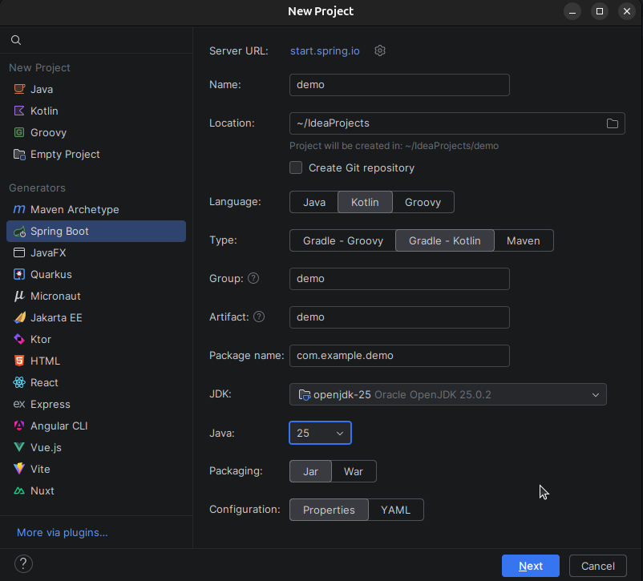
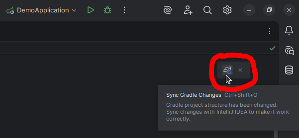

# Spring tanfolyam - 1. alkalom

---

## Miről lesz szó?

Megismerkedünk a Kotlin programozási nyelvvel, a Java futtatókörnyezettel, ami a program végrehajtását lehetővé teszi, a Gradle build eszközzel és a Spring Boot keretrendszerrel. Az objektum-orientált programozási minta áttekintése után nézünk egy demo-t is.

Fontos: a tananyagban **videó hivatkozásokat is elhelyeztünk**, amelyek emészthetőbbé és izgalmasabbá teszi a tanulást, így **megtekintésüket mindenkinek ajánljuk**.

Ha bármilyen kérdésed felmerülne, akkor [ide kattintva](https://tanfolyam.kir-dev.hu/docs/get-started/intro) megtalálod az illetékeseket, akiket tudsz keresni.

---

## Kotlin (és Java)

Ha már a Kotlinról beszélünk, akkor nem mehetünk el figyelem nélkül a Java mellett.

### Mi az a Java?


A Java **általános célú, objektumorientált programozási nyelv**, amelyet James Gosling kezdett el fejleszteni, később átvette a Sun Microsystems fejlesztett a ’90-es évek elejétől kezdve egészen 2009-ig, amikor a céget felvásárolta az Oracle.

A Java **több mint 30 éve az egyik legelterjedtebb nyelv a világon**. A **nagyvállalati rendszerek, banki szoftverek, webes backendek nagy része máig Javával készül** – és ez így is marad még hosszú évekig.

Ugyanakkor a Java kódja sokszor hosszabb és ismétlődőbb, mint kellene. Bizonyos hibákat (például null-érték miatti összeomlást) csak futás közben vesz észre a program, amit bosszantó és időigényes lehet debugolni. Kezdők számára különösen nehéz lehet követni a sok boilerplate kódot (üres metódusok, getter/setter sorok, ellenőrzések).

### Mi az a Kotlin?


A Kotlin egy **modern, barátságos programozási nyelv**, amit a JetBrains fejlesztett 2011-től. Legfontosabb jellemzője, hogy **teljesen kompatibilis a Javával**, ugyanazon a platformon (**JVM**) fut, ugyanazokat a könyvtárakat használja – mégis **sokkal kényelmesebb, rövidebb és biztonságosabb kódot lehet vele írni, mint Javában**.

Kezdetben főleg Android-alkalmazásokhoz vált népszerűvé (a Google 2017 óta hivatalosan is ajánlja), de mára a **backend fejlesztés egyik kedvenc eszköze** lett – különösen a **Spring Boot framework-kel párosítva**.

Szóval hogyan viszonyul a Kotlin a Javához?
Kotlin – **ugyanaz a motor, de modernebb kormány és fékek.**

_**Rövid videók (YouTube: Fireship): [Kotlin](https://youtu.be/xT8oP0wy-A0?si=2D4FoSEOWCF8R4aD), [Java](https://youtu.be/m4-HM_sCvtQ?si=2TDr-9M1n6xISOjV)**._

_**[Kotlin története (YouTube)](https://youtu.be/uE-1oF9PyiY?si=_wEj-exdNQRAekq5)**_

---

## Java futtatókörnyezet

### Natív kóddal járó kellemetlenség

Eddig a tanterv szerint csak C/C++ nyelvet tanultatok, amivel natív alkalmazásokat lehet készíteni. Megírtuk a kódot .c és .cpp fájlokban, majd abból a compiler segítségével egy kitüntetett architektúrájú platformra fordítottuk le a bináris, végrehajtható programot, ami CPU már gond nélkül futtatott.

Mi történik, ha azt a végrehajtható fájlt egy másik architektúrájú számítógépen próbáljuk futtatni? A programunk sajnos nem fog futni, mert a másik architektúrára tervezett processzor nem érti az utasításokat, így minden egyen architekrúrára külön-külön le kell fordítanunk a programunkat, hogy ott futtatni tudjuk.

Vajon mi a helyzet, ha azonos architektúrára (pl. x86), de másik operációs rendszerre (pl. Windows &rarr; Linux) próbáljuk átvinni a végrehajtó programunkat. Azt gondolnánk, hogy ebben az esetben végre szerencsével járunk, de mivel az operációs rendszerek rendszerhívási mechanikája eltér, így most is szomorkodnunk kell:cry:.

Tehát nem csak eltérő architektúrák, hanem **eltérő operációs rendszerek esetén is mindig úra kell fordítanunk a kódot az adott célplatformra**, ami mind fejlesztőként, mind felhasználóként súlyosan érint minket.

### JVM (Java Virtual Machine)

A **hordozhetóságnak napjainkban egyre fontosabb szerepe van**, és az előbb felsorolt kellementlenségeknek a megszüntetésére egy **remek megoldást nyújt nekünk a Java virtuális gép**.


Alább látható a különböző rétegek, amik egymásra épülnek. A Java virtuális gép (viruális gép ≈ **absztrakt számítógép architektúra**) az operációs rendszer felett helyezkedik el, és **futásidőben értelmezi neki írt kódot, amit rögtön bináris kóddá alakít, amelyet a CPU már végre tud hajtani** (az adott platformon!).


A Java fordítója nem bináris, végrehajtható kódra fordítja le az utasításainkat, hanem egy úgynevezett **bytecode-ra** (.class kiterjesztéssel rendelkezik). Ezt a bytecode-ot érdemes úgy elképzelni, mint a **Java virtuális gépre írt program elemi utasításai** (egyféle assembly kód), azaz ez **nem függ semmilyen harvertől vagy operációs rendszertől**.

A JVM előnye, hogy ez teljes mértékben egy szoftver, így az összes platformon ugyan az a specifikáció alapján megvalósíthatjuk meg, így **bevezethetve egy új réteget, amire építve elértük a platformfüggetlenséget**.

Itt azért fontos megjegyezni, hogy **sok esetben mégsem lesz teljesen platformfüggetlen az alkalmazásunk vagy csak korlátozottan**, mivel vannak olyan könyvtárak, amiket nem implementálnak az összes platformon, és a hiányzó függőséget miatt nem leszünk képesek futtatni a programunkat.


A valós időben értelmezett kód lehetővé teszi a platformfüggetlenséget, de végrehajtása nyilván lassabb, mint a bináris kódoké, így **teljesítmény-kritikus rendszerekben a használata nem ajánlott**.

Ezen kívül a **Garbage Collector** (szemétgyűjtő) is **időszakosan teljesítmény-visszaeséseket okoz**. Javában **nem kell foglalkoznunk a memória-kezeléssel**, pontosabban a memória felszabadításával, mert mi mindig csak új objektumokat hozunk létre (memóriafoglalás), viszont időszakosan jön a garbage collector, aki mint egy jó kukásautó és "elviszi a szemetet", azaz **felszabadítja a** nem használt (pontosabban: **nem hivatkozott**) **objektumokat**.

_**[Hogyan működik a JVM? (YouTube)](https://youtu.be/cAoymPToQdg?si=ex5XfPWgfJg-eGoc)**_

_**[Hogyan működik a Gargabe Collector? (YouTube)](https://youtu.be/Mlbyft_MFYM?si=_oA1Bs40cX2AEubd)**_

### JRE (Java Runtime Environment) és JDK (Java Development Kit)

A JRE, azaz a **Java futtatókörnyezet** tartalmazza a Java virtuális gépet és az egyéb könyvtárakat, ami **lehetővé teszi számunkra a programok futtatását**. Ha például Minecraft-ot szeretnénk játszani, akkor elégséges, ha JRE telepítve van a számítógépünkön.

Ha azonban előállítani is szeretnénk Java alkalmazást, akkor viszont **JDK**-ra van szükségünk, ami a JRE-n kívül a **fejlesztői eszközöket is magába foglalja**.


## Kotlin fordító

A lenti ábrán látható, hogy hogyan **működik együtt** a Kotlin fordító (**kotlinc**) a Java fordítóval (**javac**), hogy elkészítség a végleges bytecode-ot. (A Kotlin fordító **csak .kt** (kotlin) **fájlokat fordít**, .java fájlokat nem.)


---

## Build eszközök: Gradle (és Maven)

Amikor egy Spring Boot + Kotlin projektet készítünk, nem elég megírni a kódot, azt is meg kell mondani a gépnek, hogy

- milyen könyvtárakat (függőségeket) használjunk
- hogyan fordítsa le a kódot
- hogyan futtassa a teszteket
- hogyan készítsen futtatható fájlt

**Erre szolgálnak a build eszközök** (build tool-ok). A két legnépszerűbb a Maven és a **Gradle**, és mi a tanfolyamon az utóbbit fogjuk használni.

### Maven

Maven a **klasszikus, megbízható választás**, ami már 2004 óta van velünk, és sokáig ez volt a Java világ standardja. **Sok nagyvállalatnál máig ezt használják**, mert stabil és jól dokumentált.


Akkor mégis mi vele a baj?

**Konfigurációja egy** pom.xml (Project Object Model) nevű **XML fájlban történik**, és éppen ez a hátránya. Az XML fájlokat szerkeszteni és áttekinteni egy kegyetlen, embert próbáló feladat. Hátránya, hogy a fájl **gyorsan hosszúra tud nőni és ismétlődésekkel tud megtelni**, főleg bonyolultabb projekteknél.

### Gradle

A **modern, rugalmas** kedvencünk, ami 2007 óra létezik, és napjainkra **különösen népszerűvé** vált Kotlin projektekben és Spring Boot fejlesztésben.


Konfigurációja Kotlin DSL-lel történik (**build.gradle.kts** fájl) – ez azt jelenti, hogy **maga a build fájl is Kotlin kód, amit az IDE** (pl. IntelliJ:heart:) **szépen színez, autocomplete-ol és ellenőriz**. A Gradle **gyorsabb a mindennapi fejlesztésben**, mivel okos cache-eket használ, és **csak azt építi újra, ami változott** (incremental build), így gyorsítva a fordítás folyamtát. A **konfigurációja sokkal rugalmasabb, könnyebb testreszabni és átlátni**, mint a Maven-ét.

_**[Gradle használatának előnyei (YouTube)](https://youtu.be/NTnJwQbxRss?si=qbw7DcDZnVrit2YP)**_

---

## IntelliJ IDEA

Az IntelliJ IDEA (rövdien csak IntelliJ) a **JetBrains által fejlesztett egyik legjobb IDE** (integrált fejlesztőkörnyezet), **Java és Kotlin programozáshoz**. Maga a JetBrains alkotta meg a Kotlint, így itt a legsimább az élmény.


Két verzió elérhető:

- **Community:** ingyenes

- **Ultimate:** előfizetős, de **@edu.bme.hu-s fiókkal regisztráció után**, tanulmányi célokra **ingyenesen használható**. Rengeteg hasznos funkcióval rendelkezik, köztük Spring Boot projekt létrehozása, így **mindenkinek ez az IDE használata ajánlott**!

_**[JetBrains tanulmányi csomag!](https://www.jetbrains.com/academy/student-pack/)**_

_**[IntelliJ IDEA története (YouTube)](https://youtu.be/jTZVx4TCmI4?si=plvTstOzBA9bDQmm)**_

---

## Spring Boot

A Spring Boot **egy framework** (keretrendszer), **ami a Spring** nevű óriási Java **ökoszisztéma tetejére épül**. A Spring maga már 20+ éve az **egyik legnépszerűbb eszköz enterprise Java fejlesztéshez** – de régen nagyon sok konfigurációt, XML-t és boilerplate kódot igényelt.
A Spring Boot 2014-ben indult azzal a céllal, hogy ezt az egészet drasztikusan leegyszerűsítse. A mottója: „Just run” – azaz írd meg a kódot, és máris futtatható egy önálló alkalmazás, minimális beállítással.


### Miért olyan népszerű a Spring Boot?

Képzeld el, hogy egy webes API-t, REST szolgáltatást vagy mikroszolgáltatást akarsz készíteni adatbázissal, biztonsággal, logolással. Normál Springgel ehhez órákig/hónapokig konfigurálnál dolgokat. **Spring Boot-tal:**

- **Automatikus konfiguráció:** pl. ha látja, hogy van egy adatbázis driver a classpath-en, **magától beállítja a kapcsolatot**. Ha van webes dependency, **beépít egy Tomcat szervert**.
- **Beépített szerverek** (Tomcat, Jetty, Undertow): **nem kell külön app szervert telepíteni**, csak elindítjuk és már fut is a 8080-as porton.
- **Spring Initializr** ([start.spring.io](https://start.spring.io/)): pár kattintással **generál neked egy kész projektet** Gradle/Maven + Kotlin/Java + kívánt függőségekkel (Web, JPA, Security stb.)
- **Production-ready feature-ök out-of-the-box:** health check endpoint (/actuator/health), metrikák (/actuator/metrics), logolás, külső konfiguráció (application.yml /properties), graceful shutdown stb.
- **Kiváló Kotlin támogatás:** a 4.0+ verziókban **Kotlin-first feature-ök érkeznek**, pl. jobb co-routine integráció, null-safety kihasználása a Spring komponensekben.

### Spring vs Spring Boot röviden és szemléletesen

**Spring** = egy hatalmas doboz LEGO kocka
**Spring Boot** = ugyan az a doboz, de **előre összerakott** házak, autók, hidak, és egy varázspálca, ami a **hiányzó darabokat magától odateszi**, ha látja, hogy mire van szükséged.

_**Mi az a Spring Boot és miért jó? (YouTube): [CodeHead](https://youtu.be/-ILh8pl5lj8?si=sUWMl746mfezY7_4), [Mosh](https://youtu.be/v73-ps01c5w?si=EcJ66S3f6maaDH5P)**._

---

## Demo app

Nézzük meg, hogy milyen egyszerűen el lehet készíteni egy backendet Spring Bootban!

Először is hozzunk létre egy új projektet IntelliJben:



Ezután vegyük fel a szükséges függőségeket (könyvtárakat) a `build.gradle.kts` fájlban:

```gradle
dependencies {
	implementation("org.springframework.boot:spring-boot-starter-data-jpa")
	implementation("org.springframework.boot:spring-boot-starter-web")
	implementation("com.fasterxml.jackson.module:jackson-module-kotlin")
	implementation("org.jetbrains.kotlin:kotlin-reflect")
	runtimeOnly("com.h2database:h2")
	testImplementation("org.springframework.boot:spring-boot-starter-test")
	testImplementation("org.jetbrains.kotlin:kotlin-test-junit5")
	testRuntimeOnly("org.junit.platform:junit-platform-launcher")
}
```

TODO: ebből lehet, hogy nem minden szükséges!!!

Fontos: Hogy újratöltsük a projektet, kattintsunk rá a jobb felső sarokban megjelenő elefántra:elephant: Ha ezt nem tesszük meg, akkor nem fognak frissülni az imént hozzáadott függőségek, és furcsa dolgok történhetnek az IDE-ben.



sdfasdfdsf

```kotlin
package com.example.demo

import org.springframework.boot.autoconfigure.SpringBootApplication
import org.springframework.boot.runApplication
import org.springframework.web.bind.annotation.GetMapping
import org.springframework.web.bind.annotation.RestController

@SpringBootApplication
@RestController
class DemoApplication {
	@GetMapping(path = ["/"])
	fun greet() : String = "Hello World!"
}

fun main(args: Array<String>) {
	runApplication<DemoApplication>(*args)
}
```

- springboot-starter-web dependency
- annotációk
- 8080 port

## Kérdések 1

---

## OOP

OOP tldr, mert nem biztos, hogy (megfelelően) tanulták prog 2-ből az elsőévesek.

## Interfészek

Interfészek és jelentősségük

## MVC

MVC szeparáció

_**[MVC a webfejlesztésben (YouTube)](https://youtu.be/DUg2SWWK18I?si=mnspEoQvxQOl7GqT)**_

## Modell, Repository, Service, Controller

MVC a Springben

_**[MVC a Springben + Annotációk (YouTube)](https://youtu.be/zGSX5AqfKvU?si=Iilg_vO2PDqb9eYd)**_

## Demo bővítése Service-szel

Üzleti logika hozzáadása Service-ben.

## Kérdések 2

---

## Kotlin alapok

Basic Kotlin alapok, hogy értsék a kódot a későbbiekben

---

## Adatbázis: JPA és H2

## Mentsük le a köszönéseket

- data class GreetingEntity
- application.properties: spring.jpa.show-sql=true & Hibernate üzenetek

...

---

## Controller code

## DTO

## Kérdések 3

---

## IntelliJ & JDK download

Hogyan kell letölteni és setupolni az IntelliJ IDEA-t + JetBrains student plan

git clone demo repo + futtatás, hogy működik-e az IDE
