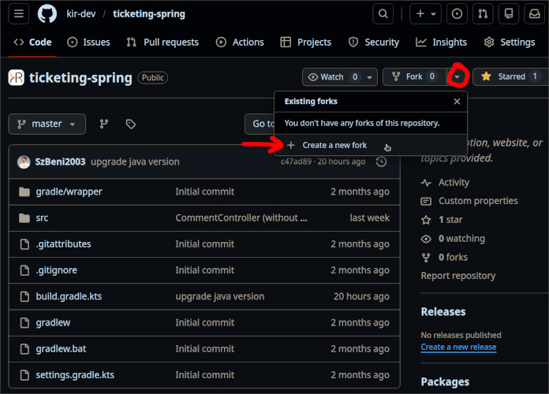
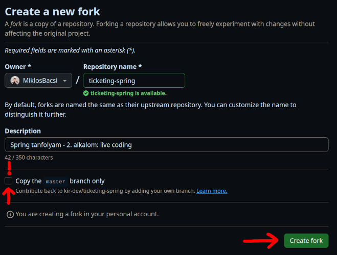
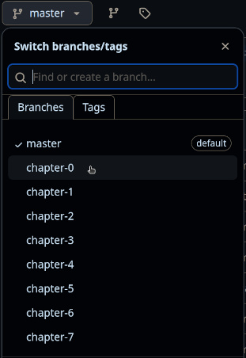
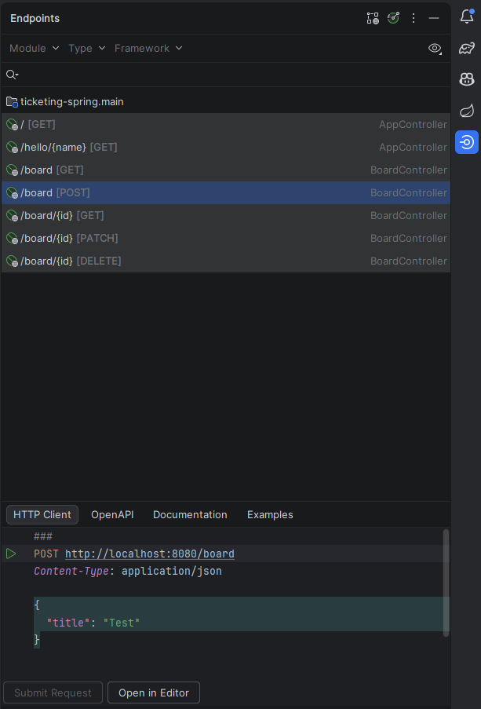

# Spring tanfolyam - 2. alkalom

A mostani és a következő alkalmon egy ticketing alkalmazást fogunk készíteni táblákkal, címkékkel, jegyekkel és kommentekkel.

---

## 0. Fejezet - Kiinduló projekt

### Fork

Látogassuk meg a [projekt oldalát GitHub-on](https://github.com/kir-dev/ticketing-spring), majd **hozzunk létre egy új Fork-ot**, amin majd dolgozni tudunk (ez lényegében készít egy másolatot a projektről a GitHub fiókunkra).



Arra figyeljünk, hogy NE csak a `master`-et másoljuk át!



Amint láthatjuk, több branch-csel (ággal) is rendelkezik a projektünk, ami a különböző fejezetekhez lett előkészítve. Ha valahol elakadnánk vagy vissza szeretnénk nézni valamit, akkor it a fejezetek között van lehetőségünk "ugrálni".



### Clone

**Klónozzuk le a** frissen létrejött **projektünket** GitHubról! Ezt megtehetjük például a `git clone <URL>` paranccsal. Ezután **váltsunk át a** `chapter-0` nevű **branchre** a `git checkout chapter-0` vagy `git switch chapter-0` paranccsal (a projektmappán belül)!

A projektünk tartalmaz már egy egyszerű Spring Boot alkalmazást (`TicketingSpringApplication.kt`).

```kotlin
@SpringBootApplication
class TicketingSpringApplication

fun main(args: Array<String>) {
    runApplication<TicketingSpringApplication>(*args)
}
```

### AppService létrehozása

Egy egyszerű szolgáltatást **hozzunk létre** `AppService` néven, két metódussal:

- Legyen egy `getHello` metódusunk, ami **visszaad egy** `"Hello World!"` **sztringet**.
- Legyen egy `getPersonalizedHello` metódusunk, ami **egy nevet** (`name: String`) **és egy napot** (`day: String?`) **kap paraméterül, majd visszatér egy köszöntéssel**. Figyeljünk arra, hogy a `day` lehet `null` is!

Először hozzuk létre a szolgáltatás osztályt!

```kotlin
@Service
class AppService{
}
```

Hogy a `@Service` annotációt használni tudjuk **importáljuk be a** szükséges **könyvtárat**:

```kotlin
import org.springframework.stereotype.Service
```

Vegyük fel a `getHello` metódusunkat:

```kotlin
fun getHello(): String{
    return "Hello World!"
}
```

Majd a `getPersonalizedHello`-t is írjuk meg. Arra figyeljünk, hogy a `day` lehet `null` is, így ebben az esetben `"day"` legyen az értéke.

```kotlin
fun getPersonalizedHello(name: String, day: String?): String{
    val Day = day?:"day"
    return "Hello $name, have a nice $Day!"
}
```

Tehát a teljes osztály így néz ki:

```kotlin
@Service
class AppService{
    fun getHello(): String{
        return "Hello World!"
    }

    fun getPersonalizedHello(name: String, day: String?): String{
        val Day = day?:"day"
        return "Hello $name, have a nice $Day!"
    }
}
```

### AppController létrehozása

Hozzunk létre egy kontrollert `AppController` néven, ami két végpontot definiál:

- A `/` végponton a szolgáltatásunk `getHello` köszönő metódusát, míg
- a `/hello/{name}` végponton a személyre szabott `getPersonalizedHello` köszönést használja.

Kezdjük megint az osztály létrehozásával, ami kap egy `@RestController` annotációt, és paraméterül fogadja az `appService` szolgáltatást:

```kotlin
@RestController
class AppController(private val appService: AppService) {
}
```

Vegyük fel a GET típusú `/` végpontot, ami a szolgáltatás `getHello` metódusát használja:

```kotlin
@GetMapping("/")
fun getHello(): String{
    return appService.getHello()
}
```

Vegyük fel a GET típusú `/hello/{name}` végpontot, ami a szolgáltatás `getPersonalizedHello(name: String, day: String?)` metódusát használja. `@Param` ???????????????????????????? nem `@RequestParam`???

```kotlin
@GetMapping("/hello/{name}")
fun getPersonalizedHello(@PathVariable name: String, @Param("day") day: String?): String{
    return appService.getPersonalizedHello(name, day)
}
```

A teljes kontroller:

```kotlin
@RestController
class AppController(private val appService: AppService) {

    @GetMapping("/")
    fun getHello(): String{
        return appService.getHello()
    }

    @GetMapping("/hello/{name}")
    fun getPersonalizedHello(@PathVariable name: String, @Param("day") day: String?): String{
        return appService.getPersonalizedHello(name, day)
    }
}
```

### Használható végpontok

Futtassuk az alkalmazást, és látogassunk el a következő URL-ekre:

```
http://localhost:8080/
http://localhost:8080/hello/Miki
```

---

## 1. Fejezet - Board váza

Létre szeretnénk hozni táblákat (`Board`), amikre jegyeket tudunk rakni, de ehhez először tervezzük meg a szolgáltatás és kontroller vázát.

### DTOk felvétele

Vegyünk fel egy `board` mappát, és abba dolgozzunk. Itt hozzunk létre egy `BoardDtos` nevű fájlt, amiben elhelyezünk két adatosztályt (`CreateBoardDto` és `UpdateBoardDto`), amiknek egyelőre csak címet adunk.

```kotlin
data class CreateBoardDto(
    val title: String
)

data class UpdateBoardDto(
    val title: String
)
```

### BoardService hozzáadása

Hozzunk létre egy `BoardService` nevű szolgáltatást (szintén a `board` mappában), aminek legyen `createBoard`, `getBoard`, `getAllBoards`, `updateBoard` és `deleteBoard` metódusa. Ezeket a tagfüggvényeket egyelőre placeholderekekkel töltsük fel, majd később fogjuk ténylegesen implementálni.

```kotlin
@Service
class BoardService() {

    fun createBoard(board: CreateBoardDto): String {
        return "This action adds a new board"
    }

    fun getBoard(id: Int): String {
        return "This action returns a #${id} board"
    }

    fun getAllBoards(): String {
        return "This action returns all boards"
    }

    fun updateBoard(id: Int, board: UpdateBoardDto): String {
        return "This action updates a #${id} board"
    }

    fun deleteBoard(id: Int): String {
        return "This action removes a #${id} board"
    }

}
```

### BoardController hozzáadása

Hozzunk létre egy `BoardController` nevű REST kontrollert (szintén a `board` mappában), ami a `/board` kezdető végpontokért fog felelni. Legyen neki `createBoard`, `getAllBoards`, `getBoard`, `updateBoard` és `deleteBoard` metódusa, ami a BoardService szolgáltatást fogja használni. A szolgáltatáshoz hasonlóan, itt is csak a vázat fogjuk felépíteni, és később írjuk meg a függvényeket.

```kotlin
@RestController
@RequestMapping("/board")
class BoardController(private val boardService: BoardService) {

    @PostMapping
    fun createBoard(@RequestBody board: CreateBoardDto): String {
        val created = boardService.createBoard(board)
        return created
    }

    @GetMapping
    fun getAllBoards(): String {
        val boards = boardService.getAllBoards()
        return boards
    }

    @GetMapping("/{id}")
    fun getBoard(@PathVariable id: Int): String {
        val board = boardService.getBoard(id)
        return board
    }

    @PatchMapping("/{id}")
    fun updateBoard(@PathVariable id: Int, @RequestBody board: UpdateBoardDto): String {
        val updated = boardService.updateBoard(id, board)
        return updated
    }

    @DeleteMapping("/{id}")
    fun deleteBoard(@PathVariable id: Int): String {
        val res = boardService.deleteBoard(id)
        return res
    }

}
```

### Új végpontok kipróbálása

Futtassuk az alkalmazást! Az IntelliJ IDE-ben van egy beépített eszköz a REST végpontok kipróbálására, de használhatunk külső eszközt is, például a Postman-t.



---

## 2. Fejezet - Board és Ticket entitás, Board kidolgozása

### Entitások felvétele

Mielőtt kidolgoznánk a táblát, készítsük el a jegyet, ami kitűzhetünk rá. Vegyünk fel egy `ticket` mappát (a `board` mellé), és hozzunk létre egy `TicketEntity` osztályt, amit most csak egy azonosítóval látunk el, illetve a jegy-tábla kapcsolattal.

```kotlin
@Entity
@Table(name = "ticket")
data class TicketEntity(

    @Id
    @GeneratedValue
    @Column(nullable = false)
    val id: Int = 0,

    @ManyToOne
    @JoinColumn(name = "board_id", nullable = false)
    var board: BoardEntity = BoardEntity()
)
```

Akkor most hozzunk létre egy `BoardEntity` entitást (a `board` mappában), ami egy táblának a tulajdonságait írja le.

```kotlin
@Entity
@Table(name = "board")
data class BoardEntity(
    @Id
    @GeneratedValue
    @Column(nullable = false)
    val id: Int = 0,

    @Column(nullable = false)
    var title: String = "",

    @Column(nullable = false)
    var createdAt: Date = Date(),

    @OneToMany(mappedBy = "board")
    var tickets: MutableList<TicketEntity> = mutableListOf(),

    ) {
    override fun equals(other: Any?): Boolean {
        if (this === other) return true
        if (other !is BoardEntity) return false
        if (id != other.id) return false
        return true
    }

    override fun hashCode(): Int = javaClass.hashCode()

    override fun toString(): String {
        return this::class.simpleName + "(id = $id)"
    }
}
```

### BoardRepository hozzáadása

Először bővítsük az `application.properties` nevű fájlt, hogy az jól tudjon működni a H2 adatbázissal.

```kotlin
spring.application.name=ticketing-spring

spring.datasource.driverClassName=org.h2.Driver
spring.datasource.username=sa
spring.datasource.password=password
spring.datasource.url=jdbc:h2:file:./temp/db
spring.jpa.hibernate.ddl-auto=update
```

Hozzunk létre egy `BoardRepository` névvel rendelkező interfészt:

```kotlin
@Repository
interface BoardRepository: CrudRepository<BoardEntity, Int> {
}
```

### További DTOk felvétele

A korábban létrehozott `BoardDtos.kt` fájlban adjuk még hozzá két adatosztályt: BoardDto és DetailedBoardDto.

```kotlin
data class CreateBoardDto(
    val title: String,
)

data class UpdateBoardDto(
    val title: String,
)

data class BoardDto(
    val id: Int,
    val title: String,
    val createdAt: Date,
){
    constructor(board: BoardEntity): this(
        id = board.id,
        title = board.title,
        createdAt = board.createdAt,
    )
}

data class DetailedBoardDto(
    val id: Int,
    val title: String,
    val createdAt: Date,
    val tickets: List<TicketDto>,
){
    constructor(board: BoardEntity): this(
        id = board.id,
        title = board.title,
        createdAt = board.createdAt,
        tickets = board.tickets.map { TicketDto(it) }
    )
}
```

### BoardService kidolgozása

Végre eljött az idő, hogy implementájuk a tábla szolgáltatását.

```kotlin
@Service
class BoardService(private val boardRepository: BoardRepository) {

    fun createBoard(board: CreateBoardDto): DetailedBoardDto {
        return boardRepository.save(BoardEntity(
            title = board.title
        )).let { DetailedBoardDto(it) }
    }

    fun getBoard(id: Int): DetailedBoardDto {
        return boardRepository.findById(id)
            .orElseThrow{ ResponseStatusException(HttpStatus.NOT_FOUND, "Board not found") }
            .let { DetailedBoardDto(it) }
    }

    fun getAllBoards(): List<DetailedBoardDto> {
        return boardRepository.findAll().map { DetailedBoardDto(it) }
    }

    fun updateBoard(id: Int, board: UpdateBoardDto): DetailedBoardDto {
        return boardRepository.findById(id).map {
            val toUpdate = it
            toUpdate.title = board.title
            boardRepository.save(toUpdate)
        }.orElseThrow{ ResponseStatusException(HttpStatus.NOT_FOUND, "Board not found") }
            .let { DetailedBoardDto(it) }
    }

    fun deleteBoard(id: Int) {
        boardRepository.deleteById(id)
    }

}
```

### BoardController kidolgozása

Hasonlóan mint a szolgáltatásnál, itt is most implementáljuk a függvényeket.

```kotlin
@RestController
@RequestMapping("/board")
class BoardController(
    private val boardService: BoardService
) {

    @PostMapping
    fun createBoard(@RequestBody board: CreateBoardDto): ResponseEntity<DetailedBoardDto> {
        val created = boardService.createBoard(board)
        return ResponseEntity.status(HttpStatus.CREATED).body(created)
    }


    @GetMapping
    fun getAllBoards(): ResponseEntity<List<DetailedBoardDto>> {
        val boards = boardService.getAllBoards()
        return ResponseEntity.ok(boards)
    }


    @GetMapping("/{id}")
    fun getBoard(@PathVariable id: Int): ResponseEntity<DetailedBoardDto> {
        val board = boardService.getBoard(id)
        return ResponseEntity.ok(board)
    }


    @PatchMapping("/{id}")
    fun updateBoard(@PathVariable id: Int, @RequestBody board: UpdateBoardDto): ResponseEntity<DetailedBoardDto> {
        val updated = boardService.updateBoard(id, board)
        return ResponseEntity.ok(updated)
    }


    @DeleteMapping("/{id}")
    fun deleteBoard(@PathVariable id: Int): ResponseEntity<Void> {
        boardService.deleteBoard(id)
        return ResponseEntity.status(HttpStatus.NO_CONTENT).build()
    }

}
```

### TicketEntity részletezése

```kotlin
enum class TicketStatus {
    CREATED,
    IN_PROGRESS,
    UNDER_REVIEW,
    CLOSED,
}


@Entity
@Table(name = "ticket")
data class TicketEntity(
    @Id
    @GeneratedValue
    @Column(nullable = false)
    val id: Int = 0,

    @Column(nullable = false)
    var name: String = "",

    @Column(nullable = true)
    var description: String = "",

    @Column(nullable = false)
    var status: TicketStatus = TicketStatus.CREATED,

    @Column(nullable = false)
    val createdAt: Date = Date(),

    @Column(nullable = false)
    var updatedAt: Date = Date(),

    @ManyToOne
    @JoinColumn(name = "board_id", nullable = false)
    var board: BoardEntity = BoardEntity(),

) {
    override fun equals(other: Any?): Boolean {
        if (this === other) return true
        if (other !is TicketEntity) return false
        if (id != other.id) return false
        return true
    }

    override fun hashCode(): Int = javaClass.hashCode()

    override fun toString(): String {
        return this::class.simpleName + "(id = $id)"
    }

    @PreUpdate
    fun onUpdate() {
        updatedAt = Date()
    }
}
```

### Ticket DTOk

A `ticket` mappába vegyük fel az alábbi DTO-kat:

```kotlin
data class CreateTicketDto(
    val name: String,
    val description: String?,
    var boardId: Int,
)

data class UpdateTicketDto(
    val name: String,
    val description: String?,
    var status: TicketStatus,
    var boardId: Int,
)

data class TicketDto(
    val id: Int,
    val name: String,
    val description: String,
    val status: TicketStatus,
    val createdAt: Date,
    val updatedAt: Date,
){
    constructor(ticket: TicketEntity): this(
        id = ticket.id,
        name = ticket.name,
        description = ticket.description,
        status = ticket.status,
        createdAt = ticket.createdAt,
        updatedAt = ticket.updatedAt,
    )
}

data class DetailedTicketDto(
    val id: Int,
    val name: String,
    val description: String,
    val status: TicketStatus,
    val board: BoardDto,
    val createdAt: Date,
    val updatedAt: Date,
){
    constructor(ticket: TicketEntity): this(
        id = ticket.id,
        name = ticket.name,
        description = ticket.description,
        status = ticket.status,
        board = BoardDto(ticket.board),
        createdAt = ticket.createdAt,
        updatedAt = ticket.updatedAt,
    )
}

```

### Eddigi végpontok kipróbálása - 2. fejezet végén

Futtassuk az alkalmazást! Ha van már legalább egy tábla, akkor hozzunk létre a táblához egy új ticketet! Próbáljuk ki a GET `/board/{id}` végpontot is, hogy lássuk a táblában létrehozott jegyet!

---

## 3. Fejezet - Ticket kidolgozása

### TicketRepository

```kotlin
@Repository
interface TicketRepository: CrudRepository<TicketEntity, Int> {
}
```

### TicketService

```kotlin
@Service
class TicketService(
    private val ticketRepository: TicketRepository,
    private val boardRepository: BoardRepository
) {

    fun createTicket(ticket: CreateTicketDto): DetailedTicketDto {
        val board = boardRepository.findById(ticket.boardId)
            .orElseThrow{ ResponseStatusException(HttpStatus.NOT_FOUND, "Board not found") }
        return ticketRepository.save(TicketEntity(
            name = ticket.name,
            description = ticket.description?:"",
            board = board,
        )).let { DetailedTicketDto(it) }
    }

    fun getTicket(id: Int): DetailedTicketDto {
        return ticketRepository.findById(id)
            .orElseThrow{ ResponseStatusException(HttpStatus.NOT_FOUND, "Ticket not found") }
            .let { DetailedTicketDto(it) }
    }

    fun getAllTickets(): List<DetailedTicketDto> {
        return ticketRepository.findAll().map { DetailedTicketDto(it) }
    }

    fun updateTicket(id: Int, ticket: UpdateTicketDto): DetailedTicketDto {
        val board = boardRepository.findById(ticket.boardId)
            .orElseThrow{ ResponseStatusException(HttpStatus.BAD_REQUEST, "Board not found") }

        return ticketRepository.findById(id).map{
            it.name = ticket.name
            it.description = ticket.description?:""
            it.status = ticket.status
            it.board = board
            ticketRepository.save(it)
        }.orElseThrow{ ResponseStatusException(HttpStatus.NOT_FOUND, "Ticket not found") }
            .let { DetailedTicketDto(it) }
    }

    fun deleteTicket(id: Int) {
        ticketRepository.deleteById(id)
    }

}
```

### TicketController

```kotlin
@RestController
@RequestMapping("/ticket")
class TicketController(
    private val ticketService: TicketService
) {

    @PostMapping
    fun createTicket(@RequestBody ticket: CreateTicketDto): ResponseEntity<DetailedTicketDto> {
        val created = ticketService.createTicket(ticket)
        return ResponseEntity.status(HttpStatus.CREATED).body(created)
    }


    @GetMapping
    fun getAllTickets(): ResponseEntity<List<DetailedTicketDto>> {
        val tickets = ticketService.getAllTickets()
        return ResponseEntity.status(HttpStatus.OK).body(tickets)
    }


    @GetMapping("/{id}")
    fun getTicket(@PathVariable id: Int): ResponseEntity<DetailedTicketDto> {
        val ticket = ticketService.getTicket(id)
        return ResponseEntity.status(HttpStatus.OK).body(ticket)
    }


    @PatchMapping("/{id}")
    fun updateTicket(@PathVariable id: Int, @RequestBody ticket: UpdateTicketDto): ResponseEntity<DetailedTicketDto> {
        val updated = ticketService.updateTicket(id, ticket)
        return ResponseEntity.status(HttpStatus.OK).body(updated)
    }


    @DeleteMapping("/{id}")
    fun deleteTicket(@PathVariable id: Int): ResponseEntity<Void> {
        ticketService.deleteTicket(id)
        return ResponseEntity.status(HttpStatus.NO_CONTENT).build()
    }

}
```

### Eddigi végpontok kipróbálása - 3. fejezet végén

Futtassuk az alkalmazást! Hozzunk létre egy új táblát a POST `/board` végpont segítségével, majd próbáljuk ki a többi végpontot is!

---

Feladatot készítette: **[Szabó Benedek](https://github.com/SzBeni2003)**
Leírást készítette: **[Bácsi Miklós](https://github.com/MiklosBacsi)**
